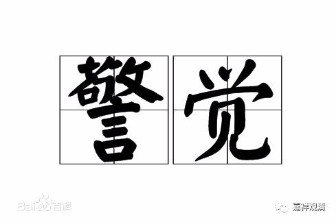

**《菩提速道》126（中）**

** “心中还应发起强烈的誓愿：愿在此一座中，根本不生沉掉，如若生起，立当断除！”**

** **

就是在这一座当中，让它更加圆满一点。

我们现在看来，越看就越觉得这像是自我催眠——“我这一座不生沉掉，如果沉掉，马上就断除”。这也就是给自己一个提醒。我们平时睡觉也是一样，你给自己一个提醒：“明天早上五点钟起来。”那么到五点钟的时候就差不多会醒过来，前后不会差个五分钟，基本上就起来了。

再比如你中午打瞌睡的时候，给自己一个提醒：“如果快递来敲门的话，就马上起来。”但是，如果你不加这个意识的话，你就会一直睡过去，睡两个小时都没问题。甚至在有人敲门的时候，你又做了个梦，梦里面有人在敲门。而你有这个提醒的话，一旦有人敲门，甚至楼下有人在剁肉馅儿，你就马上会醒过来了。

就是要有这样一个念头。打坐的时候如果有这样的念头，碰到昏沉或者掉举的情况，基于前面的这个念头，就比较容易马上反应过来、马上警醒。虽然在定义上它不属于“作意”，但我觉得这个是有点接近“作意”的意思。作意的定义是要在这一刻同时生起的，不是前面和后面的次序差别。但这种念头就有点像作意，这种警觉性是你预先已经放到“程序”里面去的，然后这个程序还在微弱地执行着，等到外面稍微有一点点声音——一敲门，马上就醒过来了：快递到了。然后一看：咦，没人。噢，是楼下在剁饺子馅儿……所以是在这里面预先加一个程序。

** “愿在此一座中，根本不生沉掉，如若生起，立当断除！”**

** **

马上断除，马上反应过来。在你心力不够的时候是醒不过来的：“哦，来快递了。”然后又在梦里面把门开了，把东西也收了。过一会醒来的时候就糊涂了：“我到底收没收快递啊？”是吧？

** “然后一心专注所缘，不令从心境中忘失，时时忆念所缘，守护彼心的续流，是初业行人修习住心的殊胜方便。若心无法摄持蚕豆粒般大小的佛身，那么可以观为一寸长，若于彼仍不能摄心，可观为五指宽大小。”**

** **

以我自己的经验，我觉得对我们来说大一点没关系的，就大一点吧，小的可能做不到。这里面的意思还是和修密法有关，因为修圆满次第的时候，会要求很小很小的，所以平时修习的时候就尽量小，什么一块钱大小啊、蚕豆粒大小啊、豌豆般大小啊等等，到最后要像芥子一般大小。所以这是和修密法有关的。就我们来说，可以大一点，至少我自己观想的都会比较大一点。像硬币那么小的话，初学可能还是观想不起来，太难想了……那可以宽泛一点，轻松一点。

