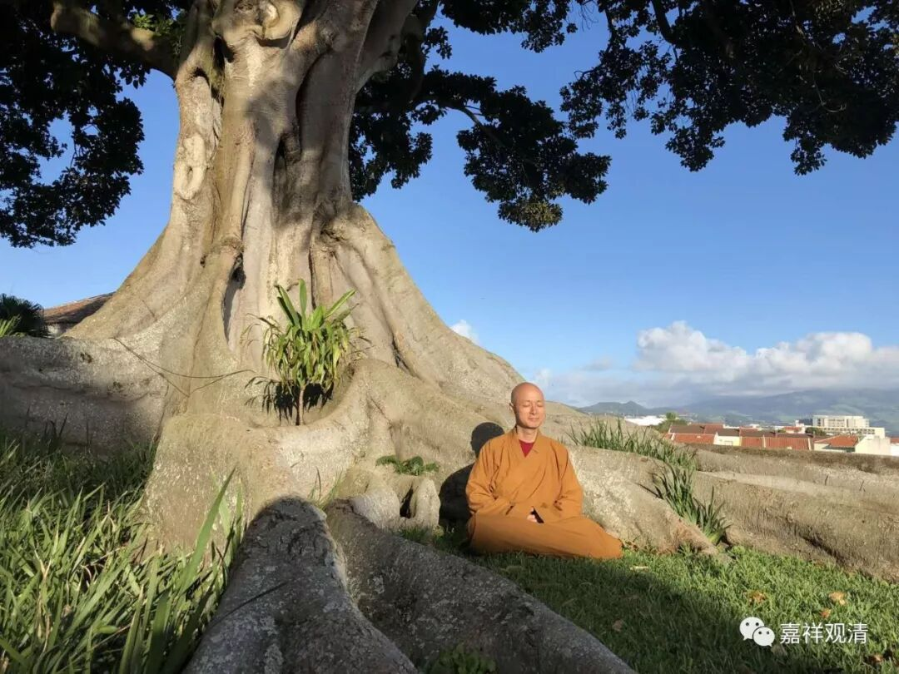

**《菩提速道》126（下）**

** “若暂时只能现起一头、二手、二足、身腹等半分总义，也应知足于此摄心安住。”**

** **

就是你只要有个对境就可以了，然后这个对境的背后有内部的含义就行了。

** “于此能摄心后，有时可从顶髻向下依次观令明了，有时可从莲月座向上依次观令明了。”**

** **

就是有时候你可以从上到下想一想，也可以从下到上想一想，都可以，并不是只有一种方法。

上次我也说过，王朔就曾经讲他描写一个人的时候通常都是从脚底写起的——穿着什么鞋，然后再一路描写上去。哎，这和《六臂玛哈嘎拉护法祈请文》是一样的哦，从脚踩着什么东西开始……然后到顶上。评书也是一样：某个人跨虎头战靴，腰缠什么什么……最后头戴什么什么。这里从上面往下观，或者从下面往上观，都可以。

** “心应松紧适度，”**

** **

太宽泛也不行，是吧？太紧张了，就要把它调整一下。一般一开始总是是做不到松紧有度，就像我们打拳的时候，肩膀总是放不下来，特别是打内家拳的时候，肩膀总是在那里扛着，太紧张了，要放松。可能是因为我在边上，所以比较紧张？如果你女朋友在边上的话，那就更紧张了。一定要放松。

** “一心安住于所缘境决定明了的状态中，这极为重要。”**

** **

这里说的“所缘境决定明了”，并不和前面的相违背。前面说能够想起来一个大概样子就可以了，这里的“决定明了”就是指大概样子，你知道就可以了。要完全观想到眉毛有多少根，做不到的，至少对我们目前来说，做不到。这个是到最后的阶段要求做到的，到观想的最高阶段是要求做到的。什么一一毛孔有八万四千的佛，对吧？一些主要的关节是八大菩萨，五蕴和四大各是什么菩萨什么佛等等，这些都要观想起来的。现在我们先泛泛地大致地想想，就可以了。

** “否则，如过去有的先贤误解了萨热哈大师所说‘心性被系缚，能缓定解脱’的意思，”**

** **

这位萨热哈大师，藏地据说是龙树菩萨的师父。

** “心太过松缓，以致进入细沉而不自知；又有些后学人因宗喀巴大师说‘生起有力正念及执持力’而太过紧张，以致无法得到住分。”**

** **

所以在这些内容当中，中道都是最难的，要恰到好处。恰到好处的因，首先是学得正确，第二是熟能生巧，到最后是任运的。

发面团也是一样，一开始怎么发都发不好，到最后就很轻松，眼睛看一看就知道了。刚开始学的时候，还要去称，糖放多少，盐放多少，到后来就任运成就了，各种配料“哗哗哗”往那一放，就正好。

一开始烤面包的时候，多半分钟就焦了，少半分钟又感觉不对，或者蛋打多了，或者蛋打少了。到最后熟能生巧的时候，一看就知道应该放多少，还骂别人笨：“这都不知道？”这不就是卖油翁吗？“此亦无他,但手熟尔。”

