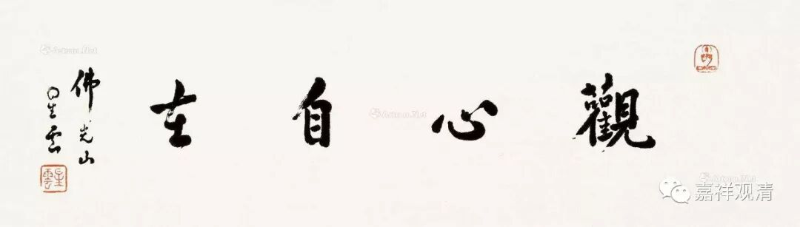
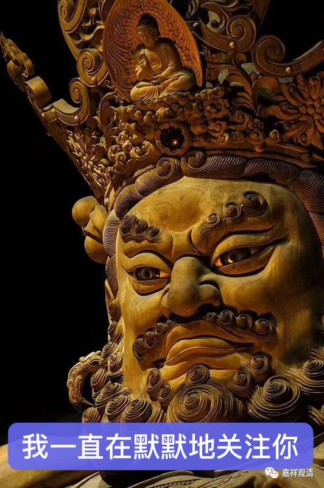

**《菩提速道》127（中）**

** “复有些补特伽罗比起缘佛身等所缘境，缘内心修比较容易现起，其法者：”**

** **

有些人观想佛像比较相应，有些人直接关心比较相应，最有名的可能就是就是修“大手印”了。

** “断除希望好的到来、畏惧恶的发生一切寻伺，心不任何造作地生起一种明显的念头，心想：即于彼摄心，专注所缘。此时，除此念头本身外，对于其他任何境，不要新地生起分别心，安住于清晰的念头本身。若生起其他境的分别心，应当决然断除，安住于前面的所缘上，令此念头，念念相继。此正是下文的密意：**

** **

看这里的文字——“** 断除希望好的到来、畏惧恶的发生一切寻伺，心不任何造作地生起一种明显的念头**”，看看是不是禅宗六祖教慧明的“不思善（** 断除希望好的到来**）、不思恶（** 畏惧恶的发生一切寻伺**），正与么时（** 安住于前面的所缘上，令此念头，念念相继**），如何是明上座本来面目？！”看看像不像？专注念头本身，念念相续……

** **

** ‘或如舞剑者，分别起即断。**

** 断已心住时，不失念舒缓，**

** 内策而舒缓，心住即在彼。’”**

** **

就像个舞剑的人，妄分别一起就亟亟断除，然后仍然安住在观心上，不忘失所缘境，内心并不放任，策励而放松，不松垮不紧张，持心一境……就这样，把自己的心作为所缘境，自己看自己。

** “这样是初业行者容易修成住心的方便。”**

** **

这个我也讲过几次吧——调心观，就是观察自己的心念。外表看有点像在那里发愣，你的心生起来，唯独那个正知还在那里观察。有点像美国和伊拉克的问题：你没事，我也没事，大家都别烦，看（勘，第一声）着你；你有事，那对不起，不许动。

**
**

** “在此是介绍心的世俗真理，而非心的究竟真理，如说：”**

** **

这怎么说呢？这不是真的修大手印，这修的是心的缘起的部分，认知的部分，不是空性的那部分，所以它还不是修大手印的部分。这就是观心，也有做“调心观”的。一般会用猫捉耗子来做比方：聪明的猫看到耗子洞，就蹲守在洞口……假如有耗子出来就一下抓住，如果没抓住也不跑出去追，因为这边一追，洞里更多的耗子就逃走了……像这样观察自己的念头。

** “‘法幢则说是，初业所修习，**

** 住心胜方便，见心世俗体。’**

** **

法幢大师说，这个是初学禅修的人入手的善方便——观心。我们平时可以在禅修的时候试试这个内容。其实平时也可以做，未必一定要端坐才行，随时可以提起正知来观察自己的心理活动。

