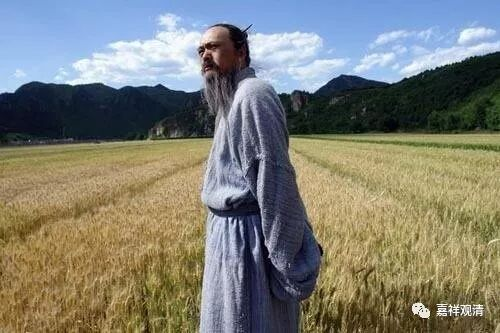
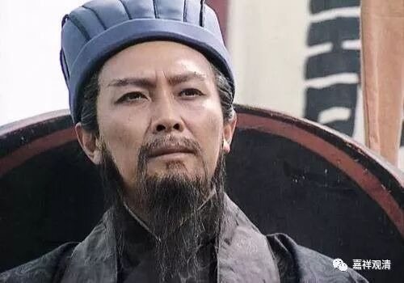
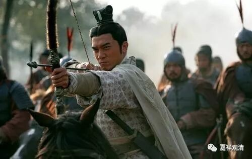
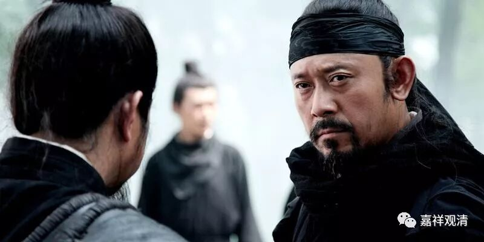

**
**

** 《菩提速道》128（中）**

** “（三）等引住于三摩地时，沉掉二者是过失。其对治法是正知。”**

** **

正知了以后，就可以对治了，对治沉没和掉举。

** “以正知善加观察有无沉掉生起。”**

** **

正知，就像一个坚固的官员，一直观察着整个禅修过程，看看有没有沉没和掉举生起。

** “智慧上者，是在沉掉将生起时，即能了知并断除，”**

** **

这个是经验比较丰富的人，快生起的时候就知道了，有烟起的时候就扑灭。

** “中者生已无间，”**

** **

中者是刚刚生起，就可以断除，火苗刚起来就扑灭。

** “最下也应不令沉掉经于久时，察觉后立即断除。”**

** **

最下也应该在沉掉生起不久就断除，就像火起不久后扑灭火势。等到熊熊火势起来，就很难了……

以上三者，一个是沉掉还没有生起，一个是生了以后马上就知道了，一个是生起略久才知道。

我记得我以前做过一个比方的。这里“智慧上者”就是诸葛亮——未卜先知，就是沉掉还没有生起来的时候，他就已经知道了。

“中者生已无间”，生了以后马上就知道了，这个是周瑜——一见就知。他出去视察军营，突然之间，旗角飘到了脸上。“啊！”吐血。“万事俱备，只欠东风”，怎么办？周瑜的智慧，比喻是生已无间，方能得知。

曹操是过后方知，比喻沉掉久时方知的那种。曹操经常这样：“嗯？你的想法和我的一样。”过了一会儿：“你再说说看，是什么想法啊？”他对杨修说：“对，你让我再想一想。”这再一想，就跑出五里路去了，然后：“我猜出来了，不过我还是要考考你。你告诉我，答案是什么？”（实际上我认为他大概是不知道的。）曹操过后方知。

所以上面三种，可以拿诸葛亮、周瑜和曹操来比方——未卜先知、一见就知、过后方知。这三种，也需要智慧，也需要经验。我们修禅定的过程，也是这样慢慢的，要从一般人过渡到曹操，进而周瑜，然后到诸葛亮，混混沌沌-过后方知-一见就知-未卜先知-从心所欲……

最后就是从心所欲，孔子老年的时候了……

        修改于