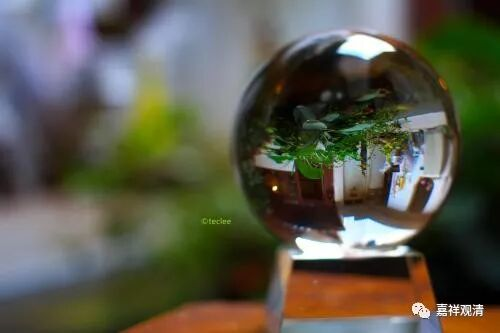
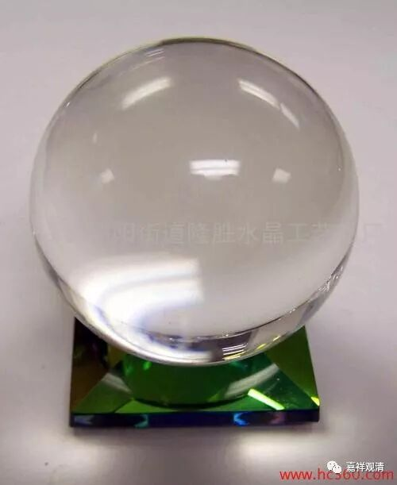

**《菩提速道》讲记129（上）**

** “它们的对治法是忆念三宝的功德，或作意明相以及修习风心与虚空相合的教授。”**

** **

就是用各种办法让自己在修订的时候更加清醒一点。“忆念三宝的功德”，就是知道三宝的功德很厉害，让自己兴奋起来。这必须是对三宝种种功德有所了解的，否则内容没有，想都想不出来，也不会兴奋。

“作意明相”呢，也是让自己兴奋一点，想自己面前是一片光明。《瑜伽师地论》里谈到过。“光明想”其实有两种。还有一种是思维法义——“法光明”。“光明想”的方法，可以拿来修神通，类似于江湖上有名的圆光术……观水晶球就是一种圆光术，藏地的观湖也可以说是广义圆光术的一种。

“修习风心与虚空相合的教授”呢，下面又将。我不知道这个是因为什么（能令心兴奋）。（我自己修了一下，我怀疑主要的原因是不是怕自己死掉，所以自己就会精神起来？它的修法好像是把你自己的身心融入到虚空当中去。我觉得这样弄两下，自己会不会死掉？——从自己的身体里出去了……然后就立即清醒过来了：“不修了，不修了，吓死了。”）

** “风心与虚空相合的教授：观自己的脐部有鸟蛋般大小的红白明点，”**

** **

多大呢？鸟蛋！是哪个鸟的蛋？鸵鸟蛋？鸽子蛋？麻雀蛋？估计不会太大。

** “从自己顶上冲出与空灵的虚空相合无二无别，于此专心平等安住。据说此与启虚空门的界识和合相似。”**

** **

这个就不知道了，反正也没有学过什么“启虚空门的界识和合”。这里是想用后面的这个来让大家理解前面的，是吧？但是后面的这个我更不知道，前面的多少他还说了一点，是吧？鸟蛋大。

** “内心不能无动安住于所缘稍微向外流散，名为微细掉举。其对治法，当依正知正念而修。”**

** **

微细的流散焦微细掉举……都是依靠正知正念来修的。这里微细掉举的说法不常见。意思上可以有，比如欲界的烦恼可以分为上中下品乃至九品，那这里把掉举分两类也不是不可以。

