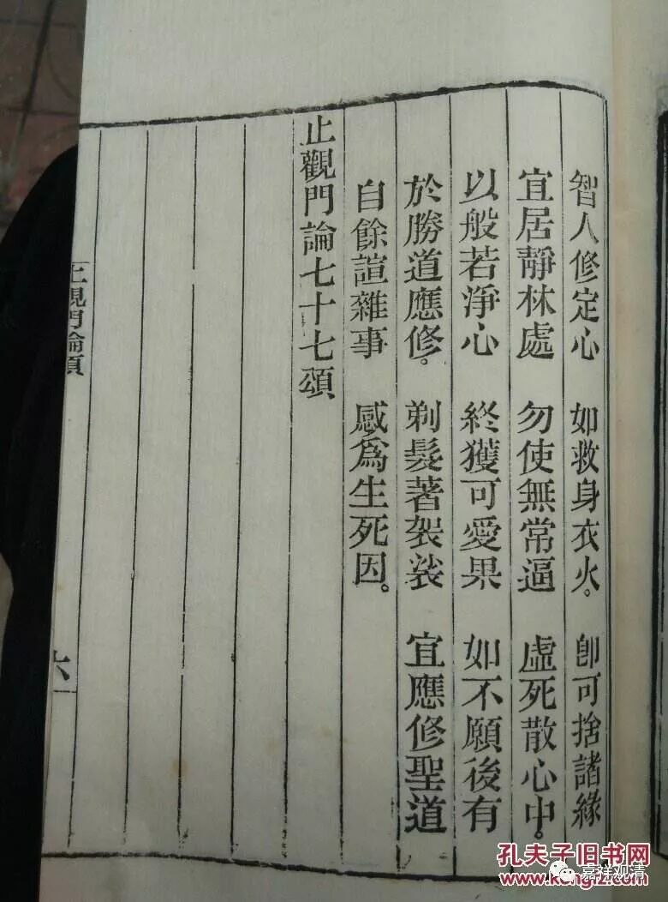

**《菩提速道》讲记130（上）**

** “（五）这样断除了微细的沉掉，心能持续住于三摩地定时，作行是过失。其对治法，是不作行，平等舍置放松而住。**

** **

断除了微细的沉没、掉举，心能持续安住……就是已经达到平等了之后，不该干涉的就不要过分干涉。“作行”就是作加行、类似于中国人说的“有为”、管闲事。

就像有个寓言当中说的，一位“哲学家”——青蛙问蜈蚣：“你是怎么走路的？”蜈蚣就开始思考了……于是就再也不会走路了。本来它是任运地在走路的，是吧？后来想多了，反而不会走了。这个就是不能想多啊！有时候想多了、过分干涉、管闲事也不好。

这个时候就是上面讲的“止、举、舍”的用“舍”的时候——不过多干涉。

** 以如是理善加修习以后，渐次获得九住心，将会成就具足身心轻安的奢摩他。”**

** **

这样用止举舍相或者说对治了昏沉、掉举、散乱、忘念等等以后，慢慢依次获得九住心，最后生起了真正的奢摩他心。

** **

** “壬三、结行：如前所说。**

** 辛二、座间如何行：**

** 座间也应当阅读开示奢摩他建立的经典及注疏等如前。”**

** **

瑜伽行派的经典提到的关于禅定方面就比较多，比如《瑜伽师地论》、《大乘庄严经论》、《六门教授习定论》、《止观门论颂》等等，这些都有，有机会可以学习学习。其中，后面《六门教授习定论》、《止观门论颂》这些汉传里有，梵藏文现在好像没有，但都保留了瑜伽行派无著、世亲二大论师的止观教授，真是很好的学习止观的内容。

南传在基础的止观方面也有很多教授，《清净道论》里就保留有很多，主要在“禅定”相应的章节里，有机会也可以多阅读学习。在这里主要有关的是关于“止”的教授。

