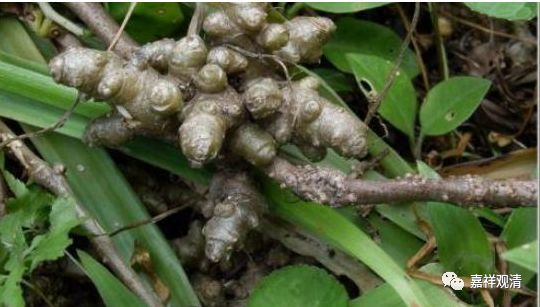
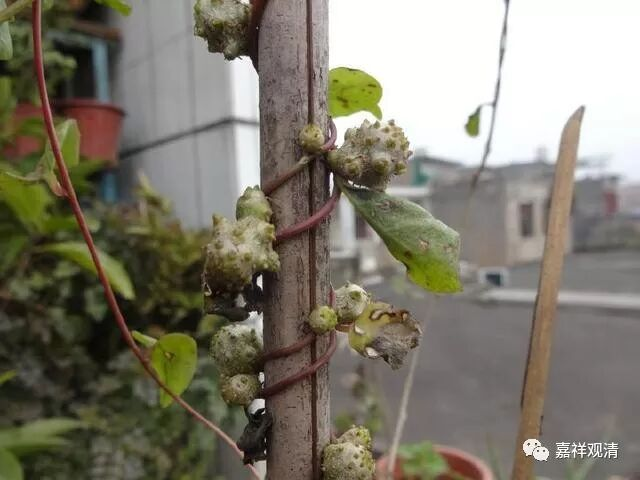

**《菩提速道》131（上）**

** “然而也不是五蕴中的任一蕴或者身心之一，而是于整个五蕴集聚或身心二者之聚上，执有一个并非仅由分别心假立，”**

** **

这个你们在观察的时候要更慢一点哦。

** “而是从最初即是独立成就的‘我’存在。这就是俱生我执执‘我’的方式。”**

** **

这个要慢慢地寻找的：“我是不是这样执着的？”这个要慢慢找。

** “其所执境的‘我’正是所应破除的。”**

** **

假如这个时候找到了我们平时执着“我”的那种方式，那么所执着的那个对象“我”就是这里所应破除的。

** “这不可仅是明白了他人的解说或者止于文字的了解，必须在自己心中有赤裸裸的鲜明定解。这是第一个要点：决定所破之显现状。”**

** **

** 决定所破之显现状，**意思就是，我们所执着的那个“我”，它的生起方式。就是首先要把它抓住。它到底是什么呢？你要去观察它。如果禅定力量非常强的话，不一定需要这样的善巧方便（就是把那种强烈的我执的心，比如委屈的心调动起来），因为如果禅定力量很强的话，其实在平时我执运作的时候，哪怕很细微，也都能够找到。

那么，如果禅定力量不够的话，就需要一些这样善巧的方式。比如禅宗的师父有时候就会很没道理地来惩罚你啊、冤枉你啊等等，而你觉得自己一点错都没有。大家看到禅宗故事里面经常都是这样的，是吧？“生姜是树上长的！”

（原来真有长在树上的生姜——藤三七）

（我对这个公案要另外解读了……）

（哎，你别点头啊！其实禅宗故事你没怎么看吧？而且看了，你也是觉得禅宗师父不对。你就不是禅宗根器嘛，一看就是道教根器。禅宗的书通常看了一半就放下来了。学算卦的时候呢：“还有吗？再帮我收集一本吧！”）

这个观察的事情大家千万不要急啊，要慢慢地做，这个观察有得要做了。

还有一点，不要以为自己一上来的观想就一定正确。可能你观察了几年都是错误的——这么说当然夸张了点，实际上你可能观察很多次都是错误的。出定以后呢，你可以根据一些教导、一些著名的经论再看看，看看、学学，“是不是应该这样观察的？”或者“是不是还有另外的观察方法？”然后，下一次的禅定当中，再进行这样的思维和观察。甚至还不一定是很认真地在座上观察，在座下也可以思维，也可以想象的。

抓住了自己的所破——自己所执着的那个对象“我”，这个时候再进行破除就容易多了。把这个，找到所破对象解决了，后面的基本上就不难了。前面的这个是实践，你把这个所执的“我”抓住了，后面的你就是靠背书就能解决大部分问题，理路都是这样的——后面的推理这是需要理路的嘛。

