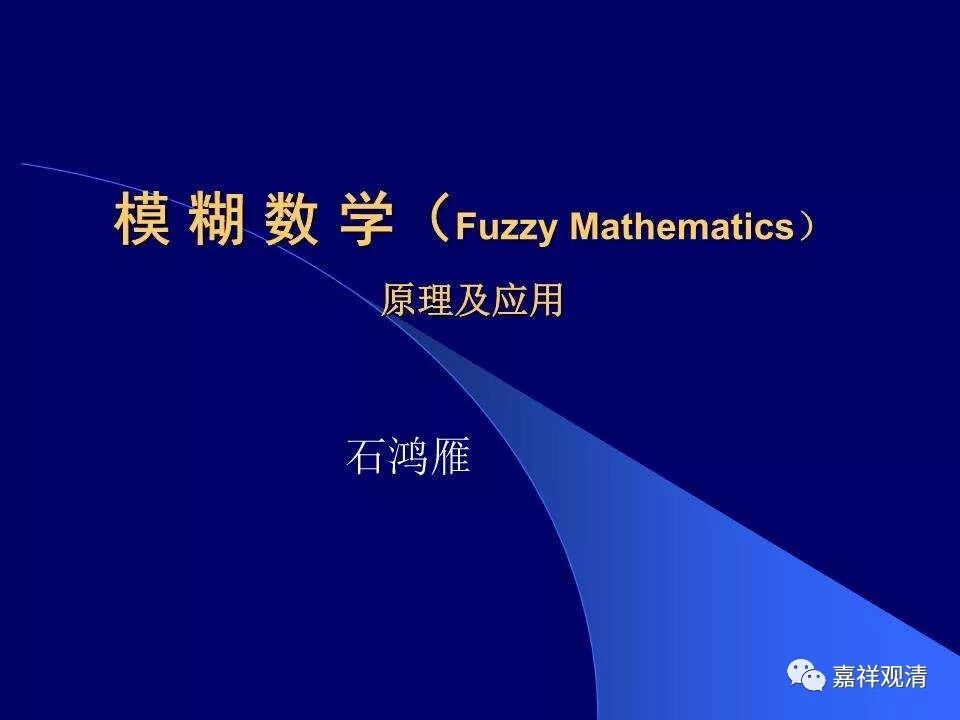

**《菩提速道》131（中）**

** “要点二，定解周遍的扼要：”**

** **

这个对于我们来说好像很简单，其实对很多人来说实在是非常想不通的，我觉得特别是对中国人来说，这个事情实在是想不通的。对于大部分的西方人，或者IT男来讲，这个可能是很容易的事情，因为不是一就是二嘛。可是对于很多中国人来说，不是一，不一定是二，也可以是三啊。你要对他讲半天，只能是一或非一，但是他仍然理解为可以既不是一也不是非一的，这是长久养成习惯了。可能很多人都要在第二点上花很长的时间，也就是说，他需要具备这个“要点二”相应的知识。

我们一直打过这个比方，好像办案子一样，首先你得有一个绝对的肯定。比如我们做过的侦探题里面，给你的条件是只有三个嫌疑犯，而罪犯一定在三个人当中。然后呢，这三个嫌疑犯各自给了一张照片来证明他们不在现场，那么你就要找出来哪张照片有问题。这是肯定能够找到的，因为你肯定罪犯就是在这三个人当中的。如果你可以完全排除另外两个人的话，第三个人的照片其实不用看了，肯定就是他了。如果这三个嫌疑犯的照片都没有问题的话，那题目的前提条件就给错了。

所以这里的前提就是，只能有这么两种情况，看你能不能观察到。

** “这个在心间紧紧顽固地执‘我’之心，如其所执之我，若在自己的五蕴上，则必定与自己的五蕴……”**

** **

大家看这里哦，假如确定这个“我”是存在的话，那么这个“我”和五蕴之间的关系只有这两种情况——这个是事先要确定的。

我们先找到了我执的对象“我”，或者找到了我执生起“我”的情况，然后我们就要确定，这个“我”和我们的五蕴之间的关系只有两种情况——要么是一，要么是异，没有第三种情况。这个大家一定要想好啊。如果有人一定要说非一非异，那么退一万步说，就得先构想出什么是“非一非异”的情况，我们再看看它到底有没有。

现在就是两种情况——一，或者异。

** “或是一或是异。除此二种状态，绝不会有第三种存在的状态。”**

** **

一种情况就是是它，一种情况就是不是它。“是它”的情况分几种，“不是它”的情况又分几种，但是总的只有这两种情况。

** “不管任何法，应当或为一的行相，或为多的行相而存在，除了这两种存在状态以外，绝不会有其他第三种存在的状态。对此，我们应当加以思惟，引生决定。”**

** **

哈哈哈哈，按照流行的“禅师体”大概在这里又出现了一个四格漫画——就在老禅师这么说的时候，数学家又来了，他说“有模糊数学”。

