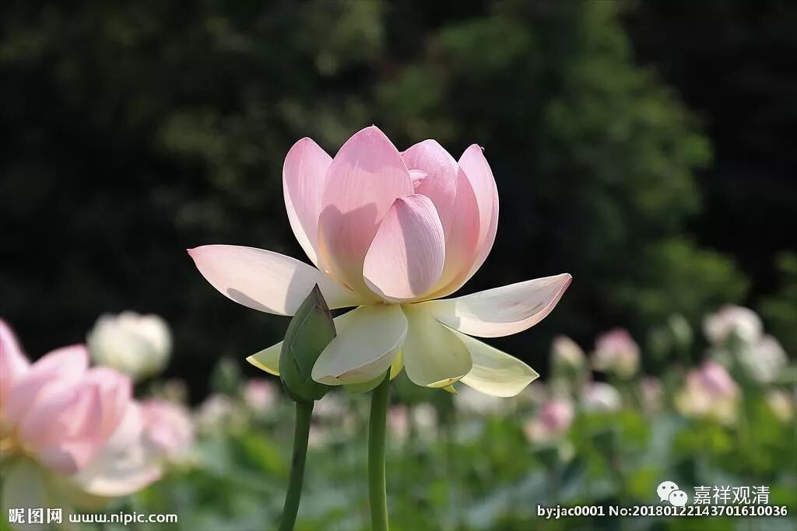

**《菩提速道》131（下）**

** “要点三，定解离谛实一的扼要：”**

** **

** “若念：‘那样所执之我与五蕴为一。’”**

** **

总共只有两个情况，所以先把“是谛实一”的情况拿来看一下。

** “则如《入中论》中所说：‘若蕴即我故，蕴多我应多。’”**

** **

这里讲到后面的内容的时候，是一定要先认知前面的内容。如果对前面的内容没问题的话，在这里就是走走形式了，毫不困难的。但是如果对于前面的内容不了解的话，在这里就算反复讲都没用的，你是听不懂的，或者你会觉得这里不讲道理。

这里要讲什么呢？如果蕴和我是一的话，那么蕴有五个，所以我也应该是五个。或者反过来讲，我是一个，那么蕴也应该是一个。这是建立在前面所讲的或是一或是异的基础上的，前提是我和蕴是一。

** “一个补特伽罗有五蕴，同样，也应当有五个不同心续的我了。”**

** **

那就是应该有五个我。

** “或者，就像我是一，五蕴也应当成为无分之一等。”**

** **

就是五蕴也应该合而为一，不可分。

这里呢，其实又要需要其他的知识储备，对于那些没学过的人或者不讲道理的人是没用的。如果你对他说补特伽罗应该有五个，他就会说：“对啊对啊，‘我’也可以有五个啊——把‘我’分成五份好了。”如果你对他说五蕴也应当合而为一，他又说：“可以啊，你们分成五蕴的嘛，我只要一个蕴就可以了。”这个就是讲不通了，和这样的人是没法讲通的。

** “如是有多种过失。故所执之我与五蕴不应为一。如是思惟。”**

** **

其实不讲五蕴的话，讲心和色也可以，就是有两个。如果对方没有学过五蕴这个概念的话，你可以和他说物质与精神，就是马列里面讲的物质和精神这两个。那么，我就应该有两个——精神的我和物质的我。最后他就承认了：“我同意啊，我有精神的我和物质的我。”那你还要继续和他讲“精神的我和物质的我”与“精神是我和物质是我”是两回事——累啊！

但是前面的学习基础已经奠定了之后，后面就是走走过场的，是不难的。如果前面没有学过这类教授的话，这里是有点复杂和困难的。

** “此外，若那样所执之我与五蕴为一，则五蕴有生灭，同样，彼心所执能独立存在的我也应当有生灭。”**

** **

这里面其实已经有矛盾了，但是一般人会觉得没矛盾：“对啊，都可以啊，我也可以有生灭的嘛。”但是，如果“我”独立实有而且有生灭了，那么……

