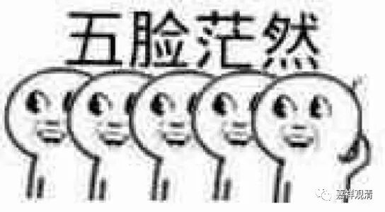

**《菩提速道》132（中）**

** “如《中论》中说：**

** ‘计取蕴即我，汝我全无义。’”**

** **

如果说取蕴就是“我”的话，这个“我”就没有意义了。就是说，取蕴本身是“我”，而这个取蕴又是“我”的所取，那么能取所取也是“一”了。但是能取所取不能是“一”嘛。就像今天我们讲的，你不能既是参赛者，又是裁判者，是吧？自己不能给自己当裁判，是吧？打乒乓的人和打的乒乓也不能是一呀。

** “此外，我与蕴二者若是无方分之一，则此士夫之身也应成为无方分，”**

** **

这是什么角度讲的，我倒不是很清楚哦。

** “若是那样，在士夫右手摇动的时候，左手是否会摇动？如果摇动，然而在士夫右手摇动的时候，现前证明左手并不摇动，被此现量损害。如果不摇动，则彼士夫的身体有动与不动两部分，就成为有方分的了。”**

** **

这个讲法我不是很清楚哦。他是不是要讲“我”是无方分的啊？他想说的意思可能，我们的身体是占有空间的，而他认为“我”是不占有空间的，是“无方分”的——可能是这样的意思。不过我这也是第一次看到有这种的分析方法哦。当然分析的话，可以很多种方法的。另外，这个分析方法是不是我们也可以去研究一下的。

我现在估计这里说的是“无分”而不是“无方分”，

** “如《释量论》中说：**

** ‘手等摇动时，一切应动等，**

** 相违之业用，于一不可故，**

** 余则应成异。’”**

** **

他这个说法就是从《释量论》里来的。

《释量论》我是看不懂的。大师们，你们来讲吧！我发现贾曹杰大师和克珠杰大师在科判上都有很大的不同哦，同一句话到底是自己讲的还是别人讲的，他们的科判都不一样。唉，他们二位大师尚且如此，我又何能啊！

** “此外，若有无方分的话，则中间一个微尘，被其上下四方六个极微尘围绕时，中间微尘观待于东方微尘的这一面，是否也观待于西方的微尘呢？若不观待，则中间的这个微尘，就有了观待东方微尘和不观待西方微尘的两部分，那么就不成其为无方分了；若观待，这些微尘应当处在同一位置，它们聚合在一起，永远也只是一个微尘，须弥山等一切的建立就会不合理。如《唯识二十颂》中说：**

** **

** ‘极微与六合，一应成六分，**

** 若与六同处，聚应如极微。’”**

** **

我不知道他为什么要把这一段放在这里。这里的内容和极微有关吗？我没搞清楚。他可能是因为在说无方分，就举了个极微的例子出来。但是实际上没关系啊，因为本身这个“我”就不是物质，根本不用拿物质的极微出来讲。

这段内容放在这里讲，实在太奇怪了。如果要讲无方分的身体，那更不对了。你这身体有脑袋、有头，怎么会无分呢？既有方又有分啊。

