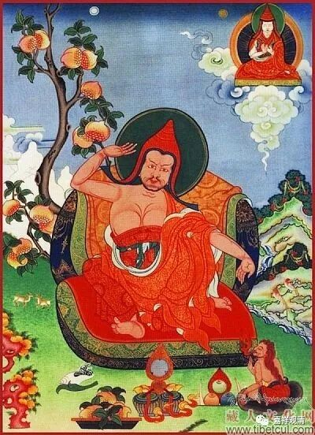

**《菩提速道》讲记133（上）**

** “要点四，定解离谛实异的扼要：”**

** **

哎呀，显然这个要点不那么容易啊！

** “若念：‘那样所执之我与五蕴为一虽不成立，然而与五蕴为异应该成立。’”**

** **

既然前面讲我和蕴不是一的话，那么显然就应该是异——这是我们通常的理解。其实这个好像还是不容易理解的。

我有个兄弟就在讲这段的时候不太懂，然后问：“到底怎么理解与五蕴为异？”我觉得按照唯识里面的内容来理解“与五蕴为异”就很简单：假如你是“与五蕴为异”的话，那你既是存在，又不是五蕴，那就变成真如了。我们本来是要证真如的，结果你已经是真如了，那你早就成功了，就不用修行了。大家都不要修了，都是自性成就了。

大家能理解吗？假如我是异于五蕴的存在，又是一种存在，而异于五蕴的存在只有真如或者说无为法，那我就是无为法。我们修了半天都是想要证得无为法的，现在你不用证了，你直接就是无为法了，那我们在这干嘛呢？多无聊啊！

** “譬如五蕴中的识蕴，在除开色蕴等一一蕴后，可以另外被识别出来，‘这是识蕴’；同样，在除开色蕴等一一后，应该可以另外显示出来说‘这就是那样所执之我’，然而却无法显示出来。所以，那样所执之我与五蕴为异不能成立。如是思惟。”**

** **

这种思维方法呢，又是陈那论师的。他们西藏人和陈那论师关系很好，他们从小就受到陈那论师的熏陶，他们的启蒙书就是《释量论》——就是法称论师对陈那论师著述的讲解嘛，所以他们用的都是陈那论师的方法。

陈那论师当时在他所在的教派（犊子部）当中表现为非常调皮的，大家都在打坐找“我”的时候，他却把眼睛睁开来到处看。他师父就说：“你干嘛？”他说：“这个非即蕴非离蕴的独立实有的我，在哪儿呢？我找找看。”结果被他师父赶走：“滚出去！”（这个好比佛教史上的“小明”，我们可以写一写哦。最好还有人帮忙画，我们跟米医生说说看，能不能请她帮忙画。）在传记里面的确是这么说的，大家都在打坐，他却在调皮地到处找。而当时这个“非即蕴非离蕴的我”是犊子部很重要的观点，是不允许被质疑的，既然你质疑的话，那就要被赶出去。

就是说，如果它是一个独立实有的存在，那应该可以找得到，但是实际上却找不到。

