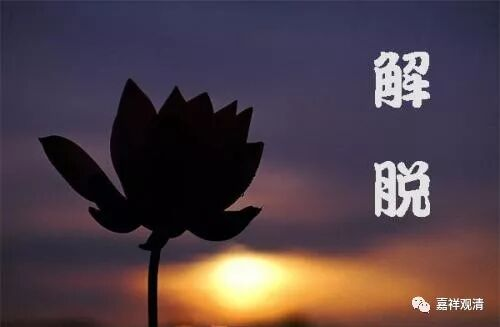

**《菩提速道》133（中）**

** “那样所执之我若与五蕴为异，在除开色蕴等一一之外，应该还可以另外指出那样所执之‘我’来。”**

** **

这个我应该是在五蕴之外另外找得到。

** “譬如马与驴二者是无关之异，除开马后，还可另外指出一个驴来说‘这就是驴’。**

** **

所以佛教的陈小明就去找陈小牛了……

** **

** 如《中论》中说：**

** ‘若离取有我，是事则不然，**

** 离取应可见，而实无可见。’”**

** **

** “若离取有我”**，如果离取蕴有我——这个“取”就是取蕴，** “是事则不然”**，没有这个事情。如果离取蕴的话，应该可以被观察到，或者被认知到，但是它又没有。

** “如是依于四要点的观察，”**

** **

啊，这里就要结束了？这么轻松啊？

那我们刚才的方法也很好啊！就是说，假如我是离开五蕴的实有的存在，按照《百法》的系统，或者说按照佛教的知识论系统，那我应该是无为法。既然我已经是无为法，那就太轻松了，我任运成就……

另外呢，假如我和五蕴是相异——在这里他讲的是五取蕴，是吧？我们来看，修行是什么呢？修行就是不要有烦恼，但是现在我和五“取”蕴相异的话，所有的烦恼和产生烦恼的这些东西，都变成跟我本身没有关系了。我们修了半天是要解决烦恼的，对吧？比如说按照声闻乘的说法，最后就是离开了取蕴——无余涅槃离开取蕴。而现在，这个我是自然就和五取蕴完全隔绝开的，各别独立，完全没关系的，那你就不用修行了，因为你本来就没有束缚没有烦恼嘛，就又变成一种不需要修行的情况了。

还有什么呢？其实有很多思维的方法啊。这里只举了一个，我们刚才又加了两个，是吧？还有很多的思维的方法。你们自己也可以想想有没有什么思维的方法，都是可以的。

在《杂集论》当中，也是专门有一段的。不过那一段当中，有些是没什么道理的，有些还是蛮有道理的。在《成唯识论》里面可能也有吧，也挺好的。这里就是太短了一点，大家其实可以从各种方面来看。

我记得我那个兄弟好像就是在带领大家一起修道次第的时候，对这一段看不太懂——“如果是异的话，会有什么问题”。于是我就跟他讲了其中的一种或者两种思维的方法，如果我不是五取蕴的话，那就太轻松了，大家都成功了，不要修行了。这个在《杂集论》当中好像叫自然解脱，是吧？你不需要修行就已经解脱了，因为你就是无为法。或者说，你和五取蕴是根本没有关系的，那你的执着就这样自然断掉了，或者说根本不存在不断的可能——因为我跟五蕴无关啊。

