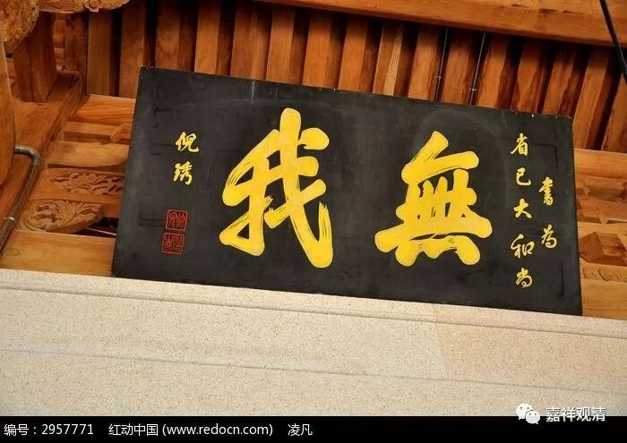

**《菩提速道》133（下）**

** “如是依于四要点的观察，如果决定了没有如俱生我执所执之我，就当远离沉掉，一心专注，将护彼定解的续流。”**

** **

那么，俱生我执所执着的“我”被找到了，它和五蕴之间就只有一和异两种情况。如果一也不是，异也不是，那你就要去怀疑人生了，你要去怀疑你的第一个判断——俱生我执的存在。最后，你只能得出结论说，俱生我执的对象是不存在的。

** “若定解力略有衰退，则初业行人当依前面所说，以四要点观察，引生无谛实的定解；慧力高者，可以观察是否如俱生我执前如何显现的我那样成立，与四要点观察相似，由此引生无谛实的定解。在这样观察的最后，初业行者应会生起一种恐惧的感觉：‘我在五蕴上，就连一点真实意义的存在也没有，我整个没有了！’”**

** **

最初学习无我的法的人会有一种恐惧的感觉……大家可以看一看啊，你们有没有这种情况。

** “如果生起这样极大的恐惧，说为最初获得了中观正见。”**

** **

这里说，引号“我”整个都没有了，就是我执着的那个“我”整个都没有了，于是生起了极大的恐惧。因为我们以前一直很习惯这个“我”的存在，突然之间自己紧紧抓住的那个东西没有了，就生起极大的恐惧心。

比如对和珅而言，乾隆死的那一刻，他就生起了极大的恐惧心，对吧？好像刀子快要落下来了，因为他依靠的对象没有了。我们在整个轮回当中依靠的对象就是这个我执，这个我执的原因是一直抓着那个“我”，而现在这个东西没有了，那就生起了极大的恐惧心，这是最初获得了中观正见时的一种情况。

** “这时在决定的心目中，决定无有自性的定解鲜明有力；而在显现的心目中，破除所破谛实后的豁然空朗。具备这两种特点，于此专一将护修习，即是根本定如虚空的保任方法。”**

在根本定中观察到“自性是根本不存在的”，是很清楚地表现出来的。然后呢，你要找的那个东西不存在，就有那种“豁然开朗”——感觉到空的感觉。保持这种状态的修习，就是所说的“根本如虚空”的做法。

