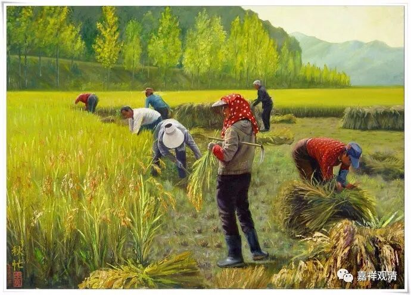

**《菩提速道》讲记134（上）**

** “在后得中，当修我等一切法犹如幻化的游戏。”**

** **

这个呢，就是常见说的——“后得如幻化”。

** “彼复依于根本定中引生的强有力的无谛实决定解，在后得中，一切任何的现相，虽然显现，而呈现为虚妄无谛实，犹如幻化般的游戏。”**

** **

就这样，初地菩萨以上观察世间的一切，都是如幻，都不是真实的存在。在这里说呢，大概就有点像在唐老那里听法的老太太一样，她的说法就是：“都是如幻，如幻就可以了。”这位老太太的故事大家都知道了吧？那时候唐老每个礼拜六、礼拜天都会到一个寺院里面去讲唯识的课。在农村有一些寺院的和尚还真的不错，会邀请唐老这样的大师来讲唯识，这些寺院还抚养了很多孤儿，这些孤儿都叫老和尚叫“爷爷”。

然后呢，因为唐老一直去那里讲课，这位老太太甚至都达到了“了解”唯识的程度。她在割稻子的时候，说是比年轻人都割得快，大家都称呼她为“老英雄”，割稻子第一名。（我想可能还有一个原因，就是现在的年轻人都变懒了。）她是怎么割的呢？一边割稻子一边念叨：“没有一颗稻子在被我割，没有一个我在割稻子，一切只是如梦如幻的影像。”所以她割得最快。这个真是太牛了。

还有一个情况就是，有些人是从隔壁县走过来听课的。老实说这些基层的人真是很了不起，竟然从隔壁县走过来，就是为了省下一些钱——其实也就省下三五块钱。他们早上很早便出发了，据说有些极端的情况早上四五点就出发了。下午两点钟的课，他们早上四点钟就出发了。他们真是艰苦惯了，然后他们一边在走路，一边就这样：“没有一个我在走路，没有一条路在被我走，这一切只是如梦如幻的影像。”居然还能走得到这个寺院听唯识——这就是本事。

后来我们听完课稍微晚点才走——我们是跟车回成都，真就看到很多人都是在走路的，寺院的人就指给我们看：“喏，这些就是隔壁县走过来听课的。”而我们呢，别说从隔壁县走过来听课，就是稍微远一点，比如多坐了五站地铁都觉得“太远了”。人家每一步都有功德，我们每一步都有罪过。哎呀，孔老夫子还是很了不起呀！他的哲学思想就有了另外一种表达，是吧？“唯上智与下愚不移。”我们这些中根的人呢？我师父说：“最难度！”——将信将疑者也！当时我还跟师父显摆：“我对他们有点办法……”现在我觉得，姜还是老的辣，啊！

        修改于