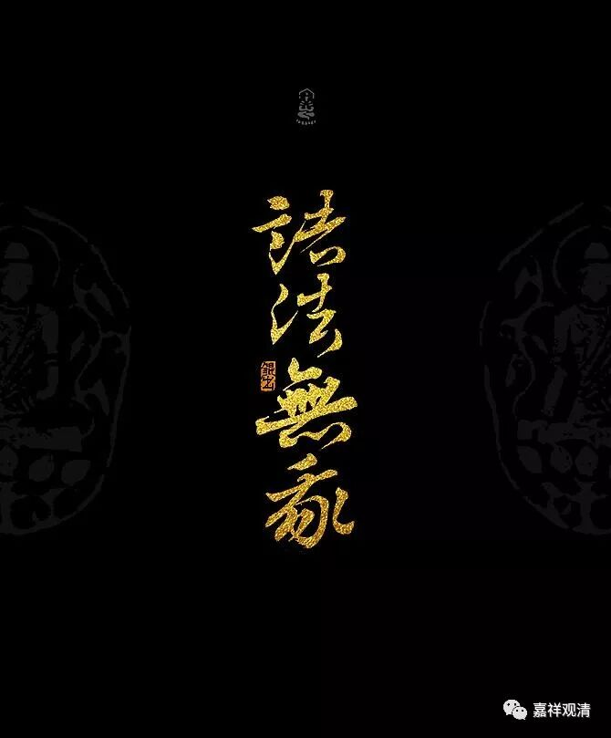
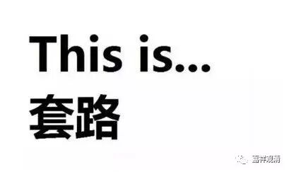

**《菩提速道》134（下）**

** “癸二、抉择法无我，分二：**

** 子一、抉择有为法无自性而修之理。**

** 子二、抉择无为法无自性而修之理。**

** 初者，分三：**

** 一、色法。**

** 二、心法。**

** 三、不相应行法。**

** 初者，抉择色法无自性：**

** 以身体为例，在仅为骨肉五肢聚集而成的这个身体上，若有不是唯由分别安立，而是自体成就的身体，”**

** **

就是一个独立实有的身体。

** “它与仅为骨肉五肢聚集的这个身体是一还是异呢？若是一，这个仅为骨肉五肢聚集的身体，是从父母的精血生成的，由此，意识所投生处的精血滴它也应该是仅为五肢聚成的身体了，而且如其有五肢分，身体也应成五肢聚集的五个身体；若是异，那么除了头等一一五肢之外，还应有一个身体可以指出来，‘这是那个身体’，然而却无法指出来。因而其所执之身是根本没有的。如是思惟，在心中引生定解后如前修习。”**

** **

这里也是一样啊。首先，我们这个身体的概念是哪里来的？在你找到了“我的身体”这个概念是这样来的，你再去分析这个概念是不是实有的。如果是实有的话，将会出现什么问题。但是不一定要按照这里的方法，我们今天已经有我们自己的知识结构，你没必要非把自己催眠成这里所说的知识结构再进行分析。我们今天的知识结构也足够我们自己分析了，这是没有问题的。

比如说芒果好了，我们一说起芒果，好像这个桌子前面的这个芒果就是不可分的一个东西，它的支分等等我们都还没有想到。可是到最后我们可以看到，实际上它不是独立实有的一个东西，按照我们现在的讲法，最多是名言有——是一个概念，安立在这个上面的一个概念而已，它具备了与此相应的所应有的一些条件而已。

既然它是有条件的，那整体和支分就很容易理解，它是依条件而建立的，那就是缘起的嘛，就显然不是有自性的。如果单单讲依条件而建的话，不一定是中观应成的观点，但是你多多少少可以理解一点缘起的那个部分——依它的支分而安立。实际上今天说的芒果，不仅仅是依它的支分而安立，而且它是唯独依名言而有的（一个概念）。在这个可以安立芒果的名言的所依上，在这个“质料因”上，在这些材料按照某种方式的堆砌上，给它一个名字叫“芒果”。我们在说“芒果”这个名字的时候，是为了让我们和周围的人沟通起来方便点——我也会指向它，你也会指向它。

这个思考的中间过程基本上没讲，但实际上的意思也还是要先找到它的支分，找到我所执着的这个“色”，或者找到我所执着的这个“身”。然后呢，“身”和他的“所依”、支分，除了“一”就是“异”，结果“一”也不行，“异”也不行……都是一样的套路，我们首先要学会这样的套路。

