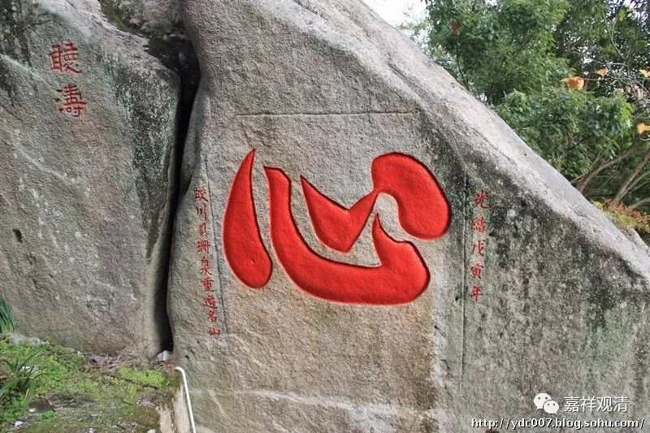

**《菩提速道》134（下）**

** “二、抉择心法无自性：”**

** **

我不知道你们怎么样，我自己在学习这一部分内容的时候，虽然是这么讲的，但是我自己一点都没有感觉。我觉得他的说法不能够说服我，“心法无自性”的这一段，包括后面破心不相应行法和无为法的那些内容，都不能说服我。

我们看看还有没有其他方法吧，我个人觉得肯定能有其他方法来解决这个问题的。他说的这个方法太简单了，可能对于他们当时的人可以解决这个问题，或是对于在他下面听课的人，或者因为时间、篇幅的关系，这样说说，就好像已经找到一点感觉了。但是仔细思考的话，我觉得这是不够的，根本解决不了我的问题。对持宗派观点的人来说，这里的破法太简单了。（从习惯上来说，我要理解为——背后有其他意思我没搞懂……）

** “以今日之心为例，在今日上午心与下午心之上，若有一种今日心，非唯分别安立而是自体成就的，那么，它与上午下午之心二者是一还是异呢？”**

** **

你看这里说的这个心的概念非常大，这么大的概念当然很容易用色法的方法来破，你看他在这里实际上就是用类似破色法的方法来破的。但实际上我们学习到今天，比如唯识啊、阿毗达磨啊等等，我们所学的心的概念不是这样的，心的成立方式是那种几乎刹那的实有的存在，绝不可能是以“今日之心”这么大的概念的方式成立，然后再用类似于破色法的方式来破除。这么大的概念，至少不是今天我所执着的心。我觉得他们学习阿毗达磨都那么多时间了，怎么会有这样的心呢？搞不懂啊。

当然，如果按照这里这样的讲法，确实可以这样破除他要破除的“今天的心”的实有。今天的心——如果大家都是这么执着的话——那显然可以分出来今天上午的心和今天下午的心，而今天上午的心里面，还有5点钟、6点钟、7点钟、8点钟这样的心，可见心不是独立实有的，至少是依于支分而成立的。

我也能够理解，因为理论比较复杂、现场人数众多的缘故，讲课的时候暂时会降低一点深度让大众理解——目前我就这么解读了。希望有人可以帮助我理解得更多……

也许，这里的意思就是——我们实际对的“心”的俱生执就这么泛泛操作的（？）。

