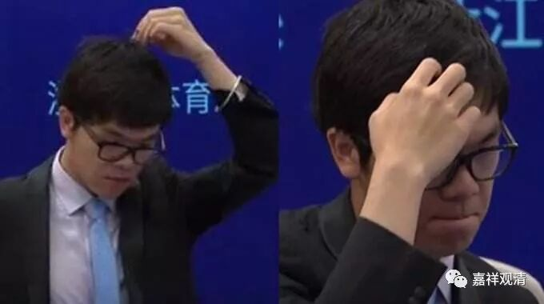
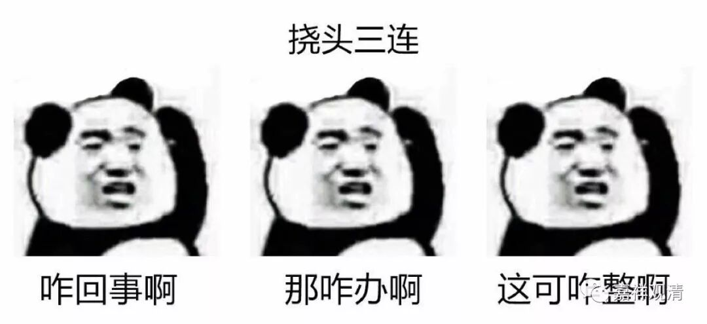

**《菩提速道》讲记135（上）**

其实我觉得还是存在这个问题：最终他要抉择的是“今天的心，不是独立实有的”，但并不是“心，不是独立实有的”。实际上我们在学习阿毗达磨的时候应该知道，假如其他宗派把这个心认为是独立实有的话，他们在讲这个心独立实有的时候，是以刹那的心作为独立实有的存在方式。这个大家能听懂吗？所以其他宗派执着的那种方式和这里要破除的方式好像是不一样的。

好像用心和境之间的关系来破除执着更加简单，但我不知道为什么不用这个方式来破除。要不你们去烧支香问问吧，我也不知道他为什么要这样破。前面色法的破除我能够肯定他，但是后面的破除法我都觉得有点奇怪，包括那个对“年”的破除也是一样奇怪，他所有的方法全都和色法的破除没差别。包括后面对无为法的破法，我也不能接受。

所以说实话，我不敢说自己对这里的内容一点都不怀疑的。当然，我的质疑并不是说“他不是佛，他在这方面的说法错误，他还没有证悟……”等等，不是这个意思。但是我觉得他在这里讲的方式或者方法我是不太理解的，至少他所提供的这种思路好像……这几种思路都是和色法的破除方法完全一样的。

难道这里认为阿毗达摩说的“心”是遍计？是分别执？不至于这么决绝吧？

** “若是一，则今日上午之心上应有下午之心；若是异，那么除去今日上午下午心二者外，还应有一个今日之心可以找出来说‘这就是今日之心’，然而却指不出来。因此，其所执之心是根本不存在的。如是思惟，如前引生定解而修习。”**

** **

那么，他似乎也只能破“今日之心”的实有，似乎并没有破“心”的实有，特别是佛教内部阿毗达磨性质的“心”的实有并没有破除。

虽然他破除了今日之心，同理可证昨日之心也没有，明日之心也没有，但是仍然不能说心没有。如果要这么说的话，那破除的仅仅是“你的假名心”，你认为的心。如果要让我和五世班禅大师来辩论这个事情的话，我会说：“你破除的是你的假名的心，而我的心的概念并非如此。”比如有部心的概念是最终的、一刹那的有法的那个心，你和我谈的根本就不是一个心啊，你只是破掉了你自己认为的那个心啊。

        修改于