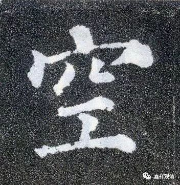

**《菩提速道》讲记136**

 ** **

** “子二、抉择无为法无自性而修之理：”**

** **

无为法，这里用的是虚空为例。这个虚空是不是无为法的虚空呢？我真的不能接受，这哪是无为法的虚空？这是色法的虚空。我觉得他在这上面有点混淆。你看，说它有东南西北，这怎么是无为法的虚空呢？明明是色法的虚空。这是什么空呢？这是空间的“空”。

** “以虚空为例，虚空有四方四隅及中间等多分。若非唯于彼等之上分别假立，而是有一个能独立自有的虚空，它与方隅彼等为一为异？若是一，则与彼等成一无方分。东方虚空应与西方虚空二者也成为一，那么，若东方空中下雨，西方空中也应下雨。有这样等多种过失，因此与彼等为一不能成立。”**

** **

** “若为异，那么，除去那些虚空的一一分之外，应还有一个虚空可以指出来‘这就是虚空’，然而却无法指出来。所以，自体成就的虚空根本不存在。如是思惟观察，引生无谛实的定解而保任修习。”**

** **

不多解释了，方法和前面一样。

** **

** “总之，我蕴、屋舍、须弥山等轮回涅槃的一切诸法，不是唯由分别假立，而是由自体成就的东西，即使尘许也没有。于此获得决定的定解后，一心专注保任修习，即为根本定如虚空瑜伽；于后得时，了知一切显现的境都是依因缘聚合而起，毫无谛实、性即虚假，即为后得如幻瑜伽。依于善加修习这两种瑜伽，由观择力引生身心轻安之乐，以此摄持的等至（等引禅定），即安立为真正的胜观。”**

** **

如果这个是真实的空性，而且依这个空性生起了身心的轻安之乐，那是什么道啊？加行道世第一？我觉得还是有问题。假如还没有发起大乘心，但是也没有趋入小乘的出离心的道，这个时候他应该不能算是加行道吧？所以我停下来是这个原因。

他既没有发起小乘的解脱心，也没有发起大乘的菩提心，在这个时候如果他对空性的认知可以在禅定当中观察到……有的说法是他修不出来，但是也可以有这种说法是可以修到的——你可以这样扛住嘛。就是假如他认同因缘聚合，但是又没有发解脱心，也没有发慈悲心的时候，怎么算呢？

有两种说法。一种说法就是：“你证不到。”另一种呢，在格鲁派系统中会说有这种人，他不是外道，是内道，而他既不是小乘，大乘心也没发起来，但他算是加行道，给他一个名字就可以了。只是多一个名字而已，实事有没有不管，先承认实事上有。有这样的情况，他既不符合小乘，也不符合大乘，那就行了嘛。

格鲁派各个扎仓的观点当中有出现过这种情况——既不是小乘又不是大乘的圣者，人家都承认了，实际上就是承认有这样一种现实。比如说回小向大的情况，他是圣者，但他又不是大乘圣者，那他的名字怎么办呢？到底该不该给这种人名字呢？那就给他一个名字好了，“不是小乘圣者也不是大乘圣者的圣者”。

在阿含经典里面有甚至还没有归依就已经证到阿罗汉的，和这个情况是不一样的。甚至没有归依已经证到阿罗汉，这是今天我们按照阿毗达磨的理论系统来讲的，因为我们把后面的定义当作是真，只要不符合这个定义的，那就是没归依。但实际上原始佛教或者说佛教最初的时候，他们根本不看这个定义的，只看有没有，只看成不成。如果再往前推的话，那就是：“有，有归依，是你后面的定义错了。”

如果我是声闻乘的，我肯定说：“我不同意，他是有归依的。”对于我们现在阿毗达磨的说法呢，我会说：“是你后面的定义错了，你按照你自已的定义来看我们的经典。我们是经部，我们是按照经来看的，经里面明明看到有这种情况，那你不承认经咯？”如果你说“不承认”，那就出现部派了嘛。

就是说，后期的阿毗达磨系统把定义都确定好以后，就用这个来解释其他的一切。但是很多情况下，这个定义是不能解释其他一切的，于是他们又编出一个新的词来，实际上是确实出现过这种情况的。对于这种实际情况他们还是想承认的，于是他们就再发明一个新的定义而已，就比如这个“既不是小乘圣者也不是大乘圣者的圣者”，很绕。

我们只是再讨论一下啊，这两种情况都是有可能的。一种就是再发明一个定义，描述这样一种人的存在。第二种就是像龙相师那样，按照经院系统顶住：“不可能出现这样的人。”她这种人就属于上座部，很保守——“只要和我不一样，那都是没有的”，是吧？而我们属于大众部——“只要有，都可以，无所谓，那就再加点新东西吧”，我们的原则是可以变化的。

