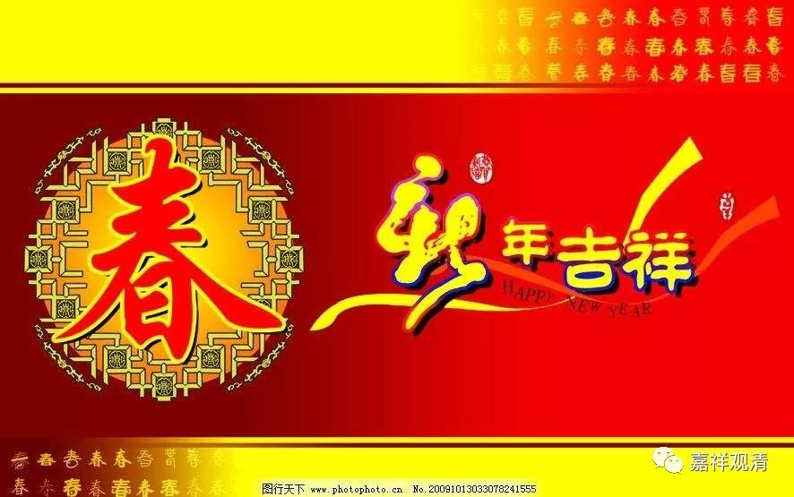
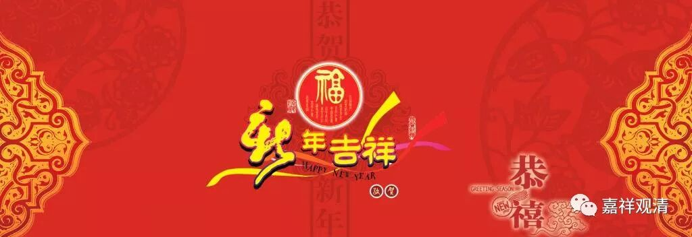
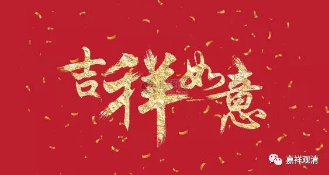
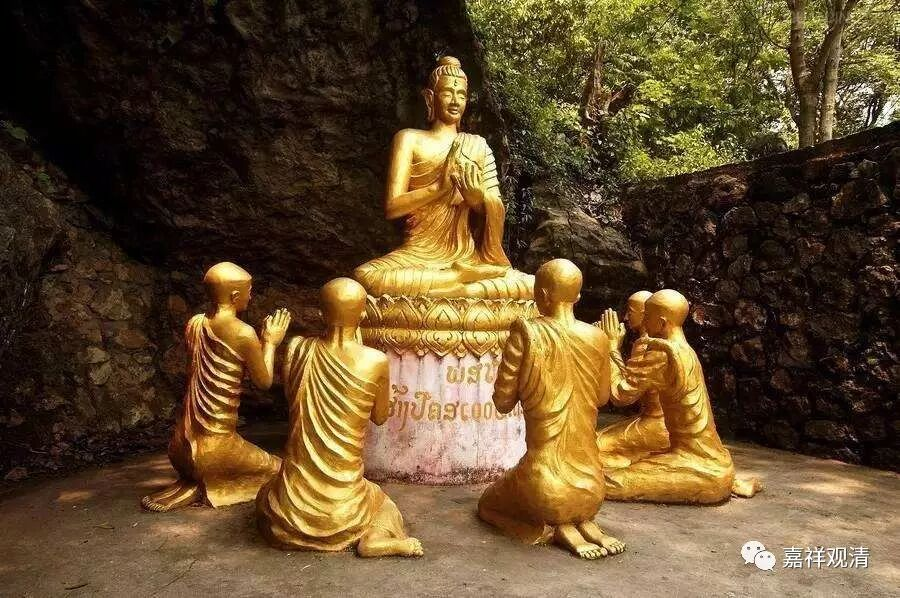
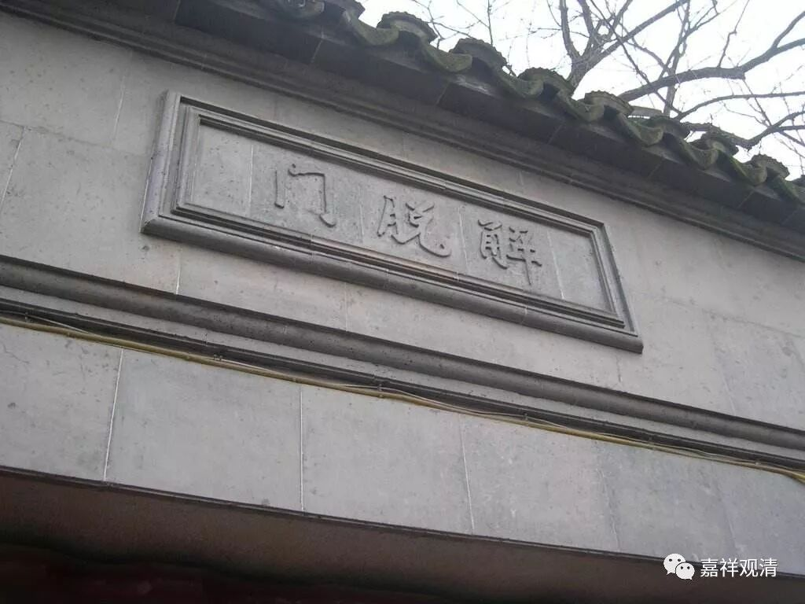

**应知方便法，不是解脱门**

新年了，似乎总要说点什么……

首先，祝大家身体健康、家庭和睦、事业顺遂、平安吉祥、世出世间，不断增上！

按最传统的佛教记岁，或者说佛教内部的新年、增岁数的日子，是在安居结束以后，七月十五（如果算四月十五开始安居的话）或者八月十五（如果算五月十五安居的话）那天类似除夕，第二天便是新年。藏经里有单行的《佛说受新岁经》和《守岁经》，《阿含》中也有同本异译的经典，不过现在很少有人会读到吧。

佛教传来兹土，“过年”的习惯便从俗，按国法说，就是以春节作为新岁了。这就是现在很强调的宗教的“中国化”，显然在这方面，佛教的做法堪称外来宗教的本土化的模范。

佛教僧团里的过年，在前一天的守岁，最重要的活动便是自恣，或者称“随意”，就是今天常说的“批评与自我批评”：各人检讨一年的行为，若有误失便向大众忏悔，大众也给予帮助并令清净，于是各人带着清净的身口意迈向新年——这也是一种身心的“洗澡”。这个套路我们也可以学习学习，所谓“检点身心好过年”。

平常人家检点的财产是物业、存款、现金……我们需要检点的也是财物——“信、戒、惭、愧、闻、舍、慧”，佛说这是七圣财，是我们在解脱路上应该长期持有的。认真想想这一年呢，不免有些惭愧，也许除了这两个（惭、愧）现在还有一点，其他数数都不那么拿得出手。好在还能起点惭愧心，新的一年便要加油了。

正如《掌中解脱》里说到的，现在是应该精进修学的日子，不似具备广播教法的环境——想想真是无比正确。（这方面就不再往下说了。）

由此忽然想到，这两年好像完全无意识地挖了几个大坑：《瑜伽师地论》、《大智度论》、《俱舍论》、《成实论》——无知如我居然不知天高地厚地手工作业（现在挖坑都用挖机了啊啊啊！！！），真不知道啥时候能填上……这样想来，真是连“惭愧”俩个都不见了。不管怎么样，继续学习下去吧，希望随着面皮的厚度增加，对佛教真意的理解也能随之增长。或者自利的同时，也能帮大家整理出一点资料，这大概可以算是一点可能的成绩吧。

哩哩啦啦信笔写到这里，算是对过去一年做一点点自省。新的一年，愿自己和大家都能学修增上，做好这个无始以来最长线的价值投资——我们把身心都压在里面了！收益嘛，大家可不要定得太近哦——

** 应知方便法，不是解脱门！**

