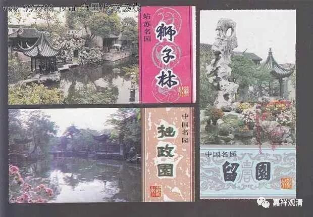
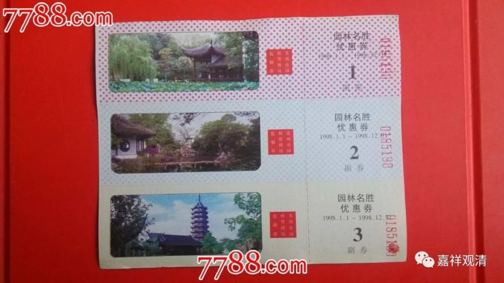

**《菩提速道》137（二）**

** “于修习彼等时，应当净除分别之心，平等地观待诸道。如果对引导如此道的善知识，显得恭敬微弱，就会断掉一切妙善的根本，故当励力修习依止法；”**

** **

就是说要依止善知识，然后哄得他很高兴。以前的人就是要哄得师父高兴，老爷子高兴了，就会多说两句，是吧？别说，以前练武的人也真是这样的。“唉呀！怎么把老爷子的好东西骗一点出来呢？”比如说老爷子喜欢去戏园子听戏，那就请老爷子看一个什么戏，有他最喜欢的一个名角在里面。然后呢，在看武戏的时候，老爷子就说：“这个身法应该再XXX就对了呀！”这就学到了嘛。

他们苏州的那些人，以前经常和傅老师在一起，他们说傅老师平时讲话的时候就很有些好东西在里面的。于是呢，他们就想方设法请傅老师喝茶。以前苏州是有园林券的，他们就到处搜集园林券，然后请傅老师去苏州园林喝茶。在喝茶的时候呢，气氛比较轻松，问一些问题就会得到很好的答案。（哎，他们怎么也不想到给我发两张园林券让我享受享受坏苦呢？）

** “同样，若对于修习，欲乐力微薄，则当修习暇满之法；”**

** **

就是不想修习的时候呢，就要想想暇满人身难得，好不容易获得，别浪费了。上辈子投资成就了这么好的学修机会，可别白白地被浪费了。知道暇满难得，就要珍惜这么好的机会，就要在善的方面、在对的方面多努力、多下工夫。

** “若对今生，耽著之心日渐严重，则应以修无常及恶趣过患为主；”**

** **

过分贪爱现世，就应该多思维人身无常、思维三恶道的苦，令自己警醒——及时熏修正法、勿致堕入恶趣。

** “若对所承许的制界，显得心存散漫，则应以修业果为主；”**

** **

如果不太把戒律当回事，就要考虑业果——黑白业的各别果报。戒律是我们的守护，舍弃戒律的行为引致苦果，所以应当收束身语意——先保证将来不堕落、今生不亏本，这样才有进一步往上走的机会。

以上属于道前基础和下士道部分。

