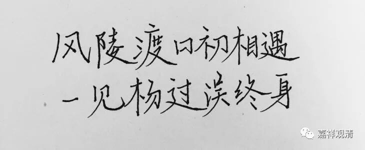

**《菩提速道》137（三）**

**
**

** “若于轮回，厌心微薄，则求解脱，唯成空言，应当思惟轮回过患；”**

** **

这句话是给我们所有人说的——“于轮回厌心微薄”。即使上辈子功德无量导致我们这辈子学佛能值遇善知识，也多是“心系方便法，无事解脱门”。经常能够遇到“聪明”的轮回勇士们提出“如何能不负如来不负卿”之类的问题；一旦家庭事业不好了，倒忽然想到“其实我还信佛教呢，我还学过道次第呢！”

我常常能遇到世出世间法的骑墙派：事业家庭不成功了，就说“我们是学佛的修行人”，等你问他“可是你学佛也是门外汉啊”，他又会回答“我毕竟是在家人嘛！”——像蝙蝠一般，两头攀附，两头不落……

至于出家人呢，且不说落了单的小和尚，就是世所传称的“法王”“大师”们也往往示现了“一见村姑误终生”，做了我们修行路上的反面典型……

如此之种种种种，世间道真是“荆棘密布”，愿大家好自为之。

说起来，这里的关键点，还是在，我们从不去串习求解脱之心，不去体会、不去思维轮回的苦、轮回的过患，反而“带着一颗感恩的心、善良的心，去寻找周围事物的美好”——这类口水文，根本就是轮回的鸡汤，全然不是解脱的教导！世间要是美好，“佛说”岂不就完完全全成了违背事实的毒药？！

所以这里提醒我们：沉溺轮回的我们，应当多思维轮回的过患！

大众！

欲服妙灵芝，当辨毒蘑菇！

