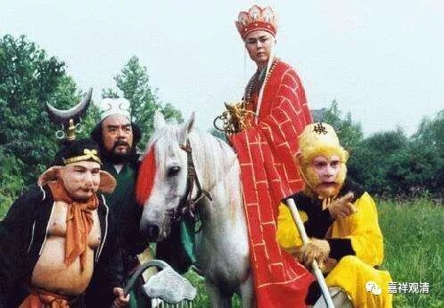
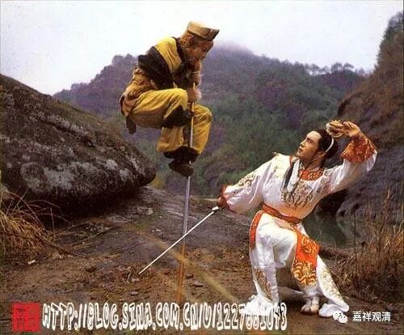

**《菩提速道》137（五）**

** 若感到心不住所缘成为散乱之奴时，应以修习心一境性的住分为主。**

** **

上面已经说了增上戒学（菩萨戒）和增上慧学（空无我智），接着说增上心学——修禅定。

按一般的解说次序，显然应该是戒、定、慧，这里却是先说了菩萨戒和空正见，然后才说禅定。可以考虑到，首先，《广论》是把《止观章》提出来单独放在最后的，这么安排篇幅也是道次第著作的一个传统了。另外，以修习、成就的次第来说，进入大乘资粮道的“门”是“愿菩提心”，发起“愿菩提心”以后便要行菩萨道，生起“行菩提心”，这都摄在菩萨律仪里面，所以先说“菩萨戒”；进入大乘资粮道以后，在资粮道的中品必须要认识、理解、通达空正见，所以接下来谈空相应的教授；进入大乘加行道，则要在禅定中比量认知此空正见，所以此后接着讲禅定、止观部分……也可以说，这是按着实修次第的教授次序。

之前谈过禅定中分别昏沉、掉举及其对治等等，这里便不再述。

修定当中另一个障碍是散乱，什么是散乱呢，就是（修定的时候）心时时地流散出去，就像《西游记》里的猴子和白马，回目里面分别叫“心猿”“意马”，我们的心就是这样管不住。修行路上，就是猴子管着白龙马——降伏其心，让他乖乖地在正确的路上前行。带路的还得是“心猿”，管的就是那个“意马”。（小白龙还就是孙行者降伏的是吧。）

《集论》说：“何等散乱？谓贪嗔痴分，心流散为体”，说“散乱”是贪嗔痴的一分；《成唯识论》说：“云何散乱？于诸所缘，令心流荡为性；能障正定，恶慧所依业”，说“散乱”别有自体，不认同（《集论》说）它仅仅是贪嗔痴的一分，而是“于诸所缘，令心流荡”——在所缘境上，“令”心流散，不集中、不住于一境，就是说，散乱是让心攀缘到其他的所缘境上去，所以障碍“正定”，而生起不应有的分别抉择（“恶慧”）。

之前也说过，在名词解释上，汉传法相多依《成唯识论》，格鲁多依《俱舍》、《集论》。

