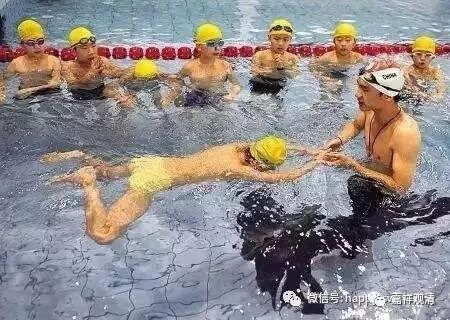
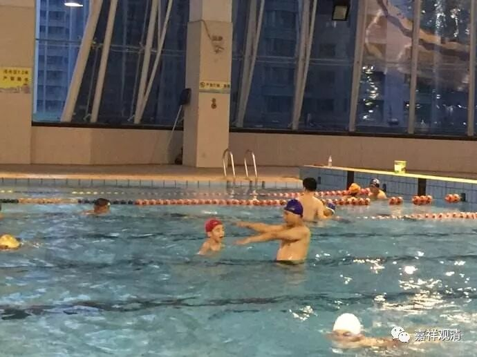

**《菩提速道》137（六）**

** 这些都是以前古圣先贤们所说的，权作代表，没有说到的也应了知。**

** **

上面只是简单地梳理一下，会有很多地方没提到的，并不是说没提到的内容不重要或者可以无视这些内容，而是据以上的内容作为代表，其他与此有关的内容也应该在修习的时候填进去，补充到相应的环节里去。

** “有人认为，对于修法而言，了知（经教）很重要。于是专事听闻。虽由听闻祛除了无知之愚，然而没有谨慎防范贪、嗔、慢、嫉等其他烦恼，由彼等引发，造下恶业，堕落恶趣。”**

** **

这里是说有些人学习了经教，但是不愿去修习、实践的问题，是吧？就像有人教人游泳，自己却不去学，终于还是旱鸭子一个。

说这个例子，是发生在我自己身上。小时候我们家就在华师大游泳池对面，我和弟弟夏天去游泳，一开始是老爸带我们去的——我们的游泳都是他教的。先在家里搞个洗脸盆放满水，把头浸到水里练闭气，慢慢能半分钟一分钟；然后在水里睁眼（当时觉得自己很牛叉，因为《三侠五义》里说翻江鼠蒋平水下功夫好，能在水里睁眼睛，而我居然也能做到！）；然后我爹带着我们泡游泳池，还给我们比划姿势，“这样、这样～唰～～唰～～”各种比划……慢慢我们学会闷头潜泳，慢慢学会换气，再能够抬头；再学各种泳姿……可是我们的游泳入门老师，我爹，前海军军人，却还是不会游泳。说起来，我爹这就是典型：能知能说，自己不实践，终于不解脱。（当然这还有也可以做另一方面的典型案例——自己做不到不一定教不会别人。哈哈。）

这段里面有个很有趣的地方，就是似乎藏传的说法比较多的情况习惯讲“贪、嗔、慢、嫉”，看到没有？或者有的地方说“贪、嗔、痴、慢、嫉”，而不是“贪、嗔、痴、慢、疑”。他们比较多用的是“嫉”而不是“疑”，这也是一个比较奇怪的地方，恐怕又是和密法有关的。不是吗？各个脉轮分别和不同的烦恼有关嘛。这里面没有“疑”，在其他地方也有这个情况，就是“贪、嗔、痴、慢”、 “疑”都是“嫉”来代替的。说起来，“贪、嗔、痴、慢、疑”是根本烦恼，“嫉”只是一个随烦恼，为什么单单把“嫉”提上来说，这里面有什么用意？这个有机会真的是可以问一下的。

