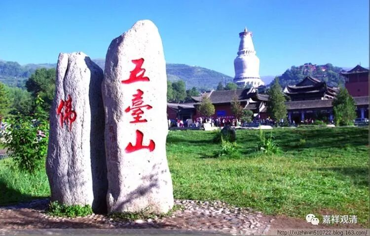
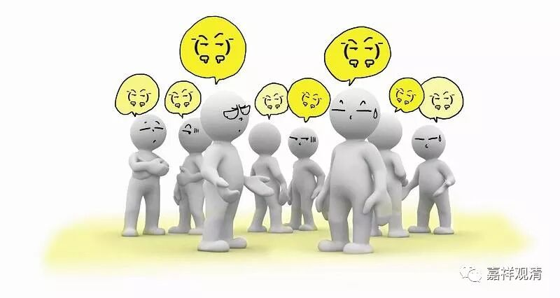
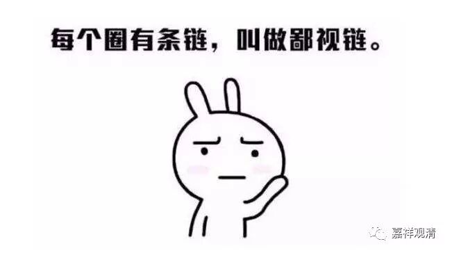

**《菩提速道》137（七）**

** “又有人认为，对于修法而言，调心最为重要。然而由于没有注意到无知的愚昧，盲修瞎炼，最终只会误入极大的歧途，并且因为不了解三律仪的制界，而使心续沾染上罪堕。**

** **

** 总之不可偏执一端，应当令心堪能趣入一切善品。”**

** **

“总之不可偏执一端”，这一句其实可以另起一段的。

就是说，一端是认为学学学学学，一端是认为修修修修修，这两个呢，都有问题。光学的人呢，就是叫说食不饱，是吧？光修的人呢，叫盲修瞎练。然后呢，就互相吵架，越吵架越觉得自己对，就越不愿意修对方的内容。其实我们应该做的是——为修而学，依学而修，努力地补上自己的短板，发现别人的长处……

记得有一次在五台山，朝拜了法尊法师出家的寺院——玉皇顶（这座寺院并没有很好地打“法尊法师”这张牌）。第二天又路过寺院门口的广场，看到几位僧人走过，突然之间我想到一件事，觉得特别好笑，也一下子特别地感慨……

我想到，就像《俱舍论》说的：“佛正法有二，谓教证为体，有持、说、行者，此便住世间”，（我来歪解一下看看啊，并不完全符合《俱舍论》原意）僧人当中大致有这三类：一类是“持教者”：住持寺院的（方丈、当家、知客这一类）；一类是说法者：法师（教学、布道、参加各种学术会议）；一类是趣证者，重视实修的（住山、住茅棚、住禅堂、闭关修行的）。在现实中，这三类人之间，大概率是互相看不顺眼的：住持们看另外两类那叫废物，都是可有可无，因人成事，完全不知道佛教现实的生存危机；法师们眼里的另两类人则都是法盲，一辈子搞下来，恐怕连是不是佛教都是问题；而在实修派、趋证者看起来，其他人都在隔靴搔痒、浪掷生命，完全不懂的修心要落实到改变心意……

当时的背景是，我们几个法师刚参加完五台山的一个佛教论坛，如丧家之犬般在五台山被（特意去拜访的、之前是对方“盛情邀请”的）几位住持冷落，又看到法尊法师不被禅和子们重视（玉皇顶有禅堂，却几乎没有关于法尊法师的介绍），猛然反省之下，发现自己也在鄙视链里——还好不是最底层。

