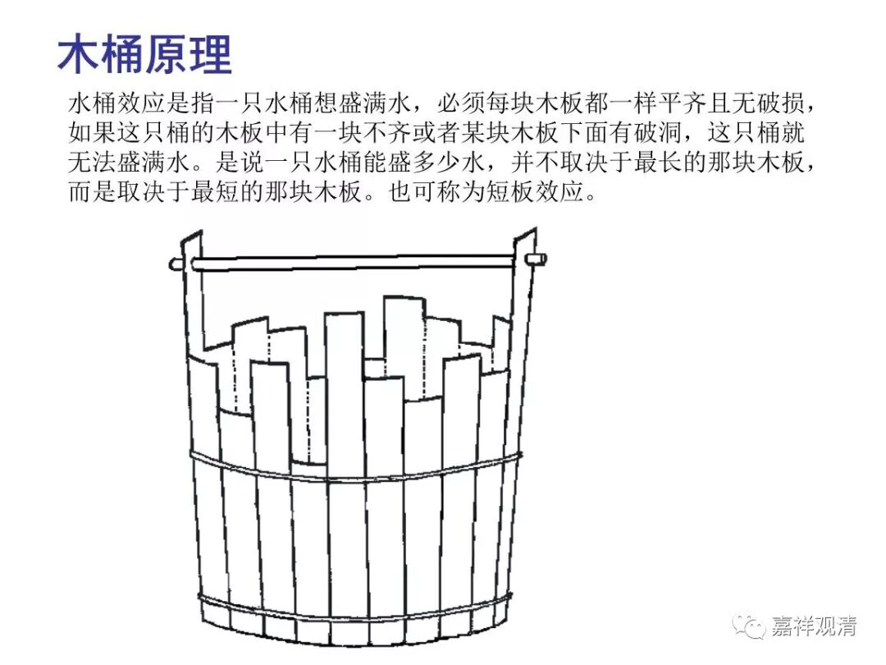

**《菩提速道》137（八）**

** “总之不可偏执一端，应当令心堪能趣入一切善品。”**

** **

就是一切的善品都要趣入。学和修这两个本身都是善的，都要有，一个都不能少掉。我们以前的中学老师就讲：“不要跛脚。”就是不能偏科得太厉害，至少每门课也要考个及格，是吧？你偏科的话，这科考得好一点，老师很高兴，那科考得很差，老师的面子往哪搁啊？特别是你把班主任的那门课给考得很差，他的奖金都没啦。

世间有两个互相打架的理论——木桶理论（短板效应），长板效应。

在这里比较适合用那个木桶理论：在佛教修学这个“木桶”上，你不能有明显的短板，你的短板决定了你成就的上限，你不能单纯只发展你的强项，虽然那样对你来说是最轻松的。我觉得同时“齐头并进”的可能性也不大，可操作的大概像我们走路，一条腿迈上，后面那条腿再跟上，次第交错前行，单纯只迈一条腿，走不了两米，也容易扯着那啥……

这里说“一切善品”，那哪些属于善呢？

一般我们会说“这个人很有善根”，那什么是“善根”呢？我们通常讲五种善根：信、精进、念、定、慧——“五根”。

另外，阿毗达摩里讲到“善法”，唯识说有十一种：“信、惭、愧、无贪、无嗔、无痴、精进、轻安、不放逸、行舍和不害”，《俱舍》说善法有十种：“信、勤、行舍、惭、愧、无贪、无嗔、不害、轻安、不放逸”，比唯识少“无痴”；《顺正理论》再加修禅定时需要的“欣”“厌”（欣乐上界，厌离下界）二法为十二。

另外，和十恶相对的，又称为“十善”：不杀生、不偷盗、不邪淫；不妄语、不两舌、不恶口、不绮语；离贪欲、离嗔恚、离恶见。

如此种种世出世间的善法，都是应该“令心趣入”、“令心堪能”、“令心生起”的。

如果我们偏执一端，就成了宗大师在《广论》里所“授记”的那样了：

“今勤瑜伽多寡闻，广闻不善于修要，

观视佛语多片眼，复乏理辨教义力……”

慎之、慎之……

