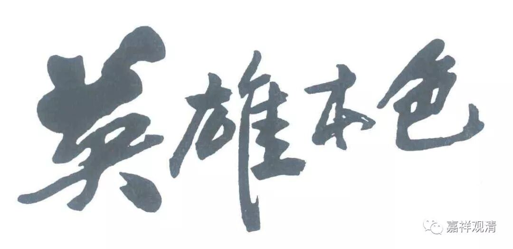
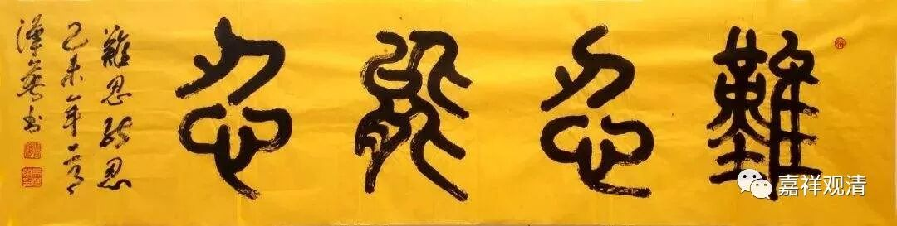

**《菩提速道》137（九）**

** “这样，由共通道善加净治心续后，就自己方面而言，虽有着为除一个有情的痛苦，也能愿在地狱中经劫久住的擐甲精进，”**

** **

“虽为了除一个有情的痛苦，哪怕长久的时间经劫在地狱里面也心甘情愿”——生起这样的悲心，真是菩萨精神，菩萨的愿力真是厉害啊！

可是我们去翻翻经典看，其实这样的“披甲精进”才是菩萨的正发心呢——是不是事情一旦具体起来就感觉其实真正的菩提心要发起来很难很难。在很抽象地想想、念念“为利众生愿成佛”（不是“为李宗盛愿成佛”啊～～～）的时候，我们似乎没感觉到菩萨行居然这么有挑战、这么有压力……

龙树菩萨在《十住毗婆沙论》（解释《华严经·十地品》的，旧译“十住”就是后来翻译的“十地”。本论唯汉译本现存）里面就说，菩萨道有“难行道”和“易行道”：菩萨发大心，本来就应该是“难行能行、难忍能忍”，这才是“菩萨”的本分和担当，要有“大雄、大力、大慈悲”的豪气才能支撑起如此的“高洁大行”，但是，众生往往对菩萨道、菩提果很向往，却没有、也很难拿出这样的英雄气概、豪杰精神……

那怎么办呐？于是在这里开出菩萨“易行道”——净土法门，各大佛陀、各大菩萨纷纷开办“专业菩萨培训学校”——净土，令这类心力不够强而又有好乐菩提果的有情能在专门的温室、暖棚里被呵护长大，在各种不同的优选条件下可以不经过很大的磨难、一路被搀扶着走上菩提道……套用戒律里面的一句话来说——“斯是方便”。

本质上来讲，“难行道”是菩萨本分，“易行道”是菩提方便，绝不能像有些人理解的“‘易行道’要高出‘难行道’”——至少《十住毗婆沙论》原文里没有这个意思。当然，作为利益众生的方便，不了义地主推“易行道”，这种方式也可以理解。其实说实话，我们的心力、福德、智慧恐怕都离“难行道”还远得很，但我还是要提醒，“难行道”才是菩萨本分！

        修改于