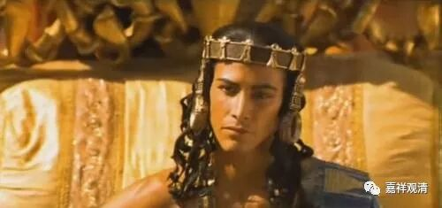
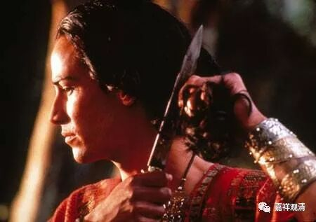
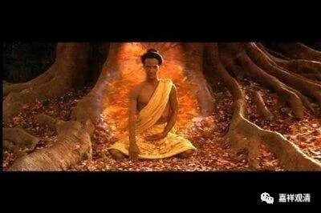

**《菩提速道》137（10）**

** “但当思及有情为苦所逼的情境之时，若心中不由自主地生起这样的心愿：‘若能成就圆满佛陀，则一一刹那，亦能救无量有情脱离痛苦，因此，我现在就成就圆满的佛陀！’如果有了这样强烈的心愿时，就一定要趣入金刚乘。”**

** **

所以发起菩提心，本来就是极其高尚的道德责任感：“让我来解决这所有苦痛的根源”——就像释迦太子游行四门后所发出的心念一样，这是一种带着最高责任感的寻求解脱的愿力。

就离我们最近的来说，其实释迦太子的一生就是“大乘菩提道”最好的注解：游行四门后生起的是知苦后的“大愿”，六年苦行是“大行”的实践（类似发明的过程——不断试错后的坚持），树下思维十二缘起而解脱是由知而觉的“大智慧”。

所以我们如果要学习大乘发心和实践的话，佛陀的传记就是我们眼前最好的参考实例——这样“由衷”而生起的“我来承担”的责任感才是大乘的菩提心。从这个角度来讲，“王子”这个角色设定也是一个重要的背景——在这个位置上成长的人习惯了大格局的视角，是“天生的”领导者。真的很难想象从小在最底层摸爬滚打出来的人能** 自发地**有如此宏大开阔的格局。

基于这种最高的承担、无上的责任感，觉得自己非速速成就圆满正觉不可，否则无量的有情仍将长久地流转于解脱门之外——这样焦急不忍众生苦的解脱发心，才和密乘的发心相应。有些人认为“哦呦这么多东西要学啊能不能少学点我还是赶快找个成就法解脱吧……”类似这类发心，恐怕连大乘发心都算不上，更别说密乘的发心了……其实很多人心里的密乘之路实际只是懒人的无知方便门罢了，套用一句禅宗里的话，这是——先师意尚未梦见在！

** “如果有了这样强烈的心愿时，就一定要趣入金刚乘。”**在这里，五世班禅大师建议——当这样的心愿真实生起的时候，有金刚乘这样的方法可以帮助到你。这一款是放在这里用的！我的理解：只有放在这里用的金刚乘才算是解脱道，拉到其他地方去的时候，“它”就弱化成了方便门。

