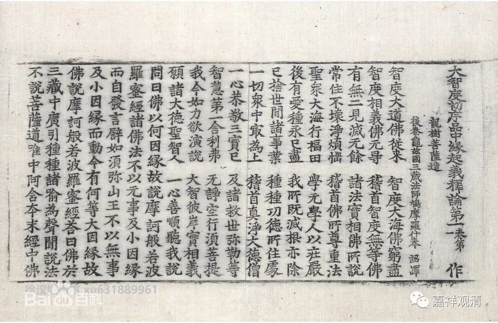

**《菩提速道》137（十一）**

** “因为依靠此道，不需观待三无数劫，即可迅速顺利地圆满二种资粮故。”**

** **

这是说，真正的法器、遇到恰当的教法、完美的善知识，在这样观机逗教最佳的配置正应该用得上金刚乘的时候，此人即使在浊世也有十四生、七生乃至即生圆满二种资粮的机会——这也是先世资粮成熟的果报……

其实，按汉传来说，并不见得修习大乘需要经历“三无数劫”，龙树菩萨的在《大智度论》（目前藏地没有这个的译本，据说夏坝仁波切刚翻译了一部分）里面说，成佛并不一定需要三大阿僧祇劫的。这个“三大阿僧祇劫”的定数，确定的时间，是迦旃延尼子们（有部师）的胡说，是他们自己想出来的。他说：该断的断，该证的证了，就成就了，没有什么“法尔如是”的时限，多少都是可以的。禅宗后来还发挥说：三无数劫其实只是说的“贪嗔痴”而已……

** “以上以觉受引导的方式，讲解了从依止善知识法直至止观的情况。每天修四座，最低也应修习一座。若于此道次第令心生起变动的觉受，实是令有暇身获取心要的最胜方便。”**

** **

那么，前面的仪轨呢，可以按照《菩提道次第明晰引导速道前行念诵次第易行仪轨•有缘颈严》的内容，就是我们这里《成就盛宴》前面的部份。也可以再略一点，你自己把里面的科判稍微缩略一点也可以。要再短一点呢，那就是《兜率百尊深道上师瑜伽法》，也可以。就是以这个为前行，如果再稍微多一点的话呢，就再念一个《菩提道次第摄颂》，就像我们今天这样，念《求加持颂》或者《摄颂》都可以。

每天修四座。道次第的观修法呢，相对其他的来说，要轻松很多。它是显宗的，所以你看书也可以，走动走动也可以，并没有太多的说法，没有太严格的要求。在这里修习一座，然后待会出去买点东西啊等等，也可以的，不一定要很严格。

