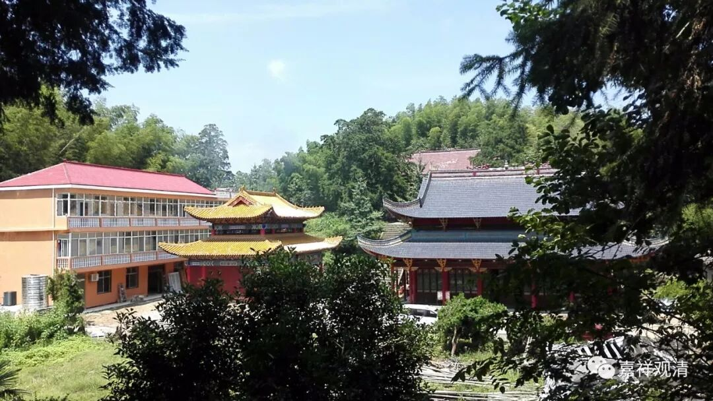

**
**

** 《菩提速道》138（下）**

** “二零零一年初译部分于浙江龙翔寺，”**

** **

后面是缘宗法师自己写的，是吧。

龙翔寺在温州，我去过，在一个公园边上。

** “后圆满译于青海隆务大寺却丹康村，并且请宗峰法师详加润色，复于二零零七年冬再校于青海隆务大寺善缘栖心苑。”**

** **

感谢缘宗法师，感谢各位大师，感谢一切应该感谢的人。

这个是“菩提道次第八大引导”当中的一个，是班禅大师写的。

下面要念回向的，是吧？好，我来给大家念一段回向文。哎，你们笑什么啊？你好像笑得不太地道，难道你也在那个群里面吗？什么？你不在那个群里面？那你是怎么知道你不在那个群里面的？这就是断案子很重要的一点啊。你怎么知道你不在那个群里面的呢？

前两天我也是抓住了一个破绽哦，说有一个回民的家里，儿子存心要玩他父母，就在菜里面放了猪肉，结果被他父母吃出来了，打了他一顿。我突然就反应过来：“他父母怎么会吃得出来呢？他们如果没吃过猪肉的话，他们怎么会吃得出来的呢？”所以，如果你不知道是哪个群的话，你怎么能够说你不在那个群里面呢？

我们一起来回向一下吧。这几天的道次第传讲就要结束了，最后让我们一起来回向：

首先，愿以此功德回向给我们在场的每一位，回向给在微信上关注我们的每一位，以及用其他不同形式关注我们的每一位。愿你们每一位修学经律论三藏、戒定慧三学的各种成就日益增长，迅速圆满福德与智慧二种资粮；愿你们每一位寿命、威德、财富、福报、学修经律论三藏、勤修戒定慧三学的智慧等等，皆得以增长。

其次，让我们共同回向我们这个世界、我们的国家、我们的民族、我们的人民，祈愿世界和平，祈愿我们的国家繁荣昌盛、国泰民安，祈愿风调雨顺，百业兴隆，百姓安居乐业。

再次，让我们回向今天听得到、看得到我们道次第传讲的每一位，包括今天在场的小虫子、小蚂蚁等等的一切有情，生生世世永离恶道，生生世世获得八瑕十满异熟功德，离一切苦，得一切究竟乐，愿六道众生不但得到现前的人天快乐，而且速疾速疾证得圆满无上正等正觉佛陀果位，俱可成为现前增上究竟决定的一切安乐与解脱。

然后，让我们感谢给予我们佛教事业无限关心的人们，感谢造成我们这次法会缘起的所有的人们和因缘，也感谢一切众生，因

为他们没有障碍我们的这次法会，对吧？所以他们也是缘，要感谢一切众生。在这一切当中，当然包括我们的主席、我们的各类领导们、各类善信居士们，还包括我们的邻居们等等。你们看，这两天他们也不刷油漆了，也不装修了，要感谢他们。感谢大家的理解、帮助和支持。

最后，让我们回向十方一切弘扬正法的高僧、大德、善知识，愿他们身体安康。也愿十方的善信身体安康，吉祥如意。

最后的最后，让我们共同回向正信佛法永驻于世！让我们也早早地，速疾速疾成就无上正等正觉佛陀果位。

谢谢大家！（长时间热烈的掌声）

总的来说，这次能得一次善讲闻，是一切的佛经都在动，是吧？以后基本上每年的十一长假我们都会进行菩提道次第的传讲。这次是《速道》，前年《广论》也传讲过了，是吧？《乐道》、《纯金》和《善说精髓》都比较短，以后有机会可以传讲。

好，今天我们先到这里。

最后来供一个长的曼扎吧。

……

最后，谢谢辛苦整理的格信团队，是他们把讲义录音变成了文字。

预告：

接下来连载《善说精髓》讲记