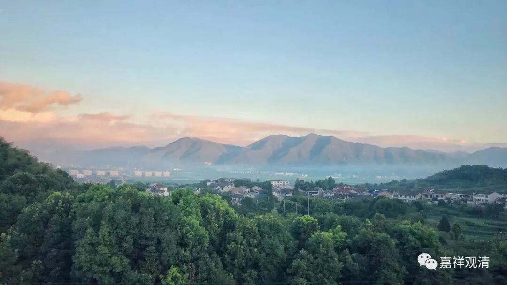
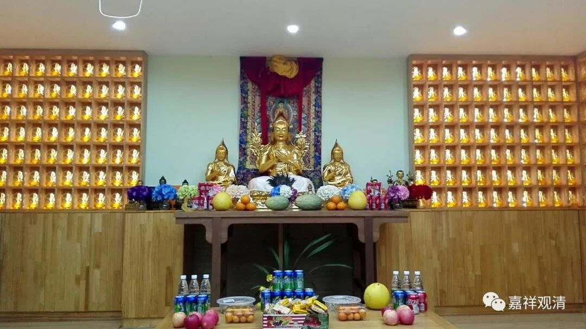
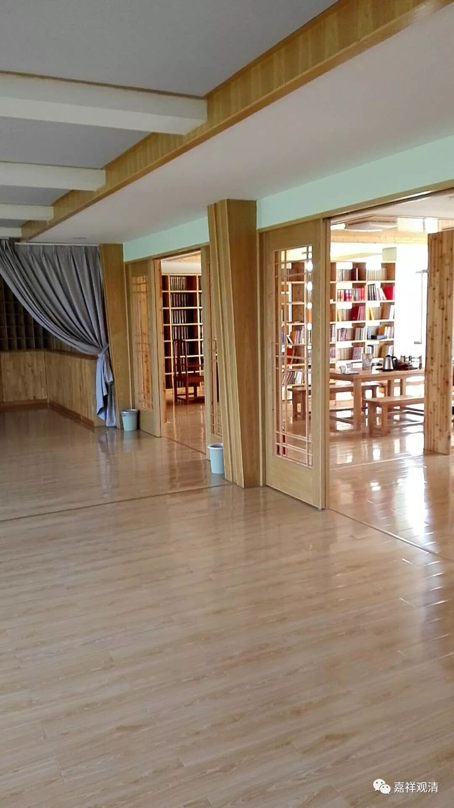
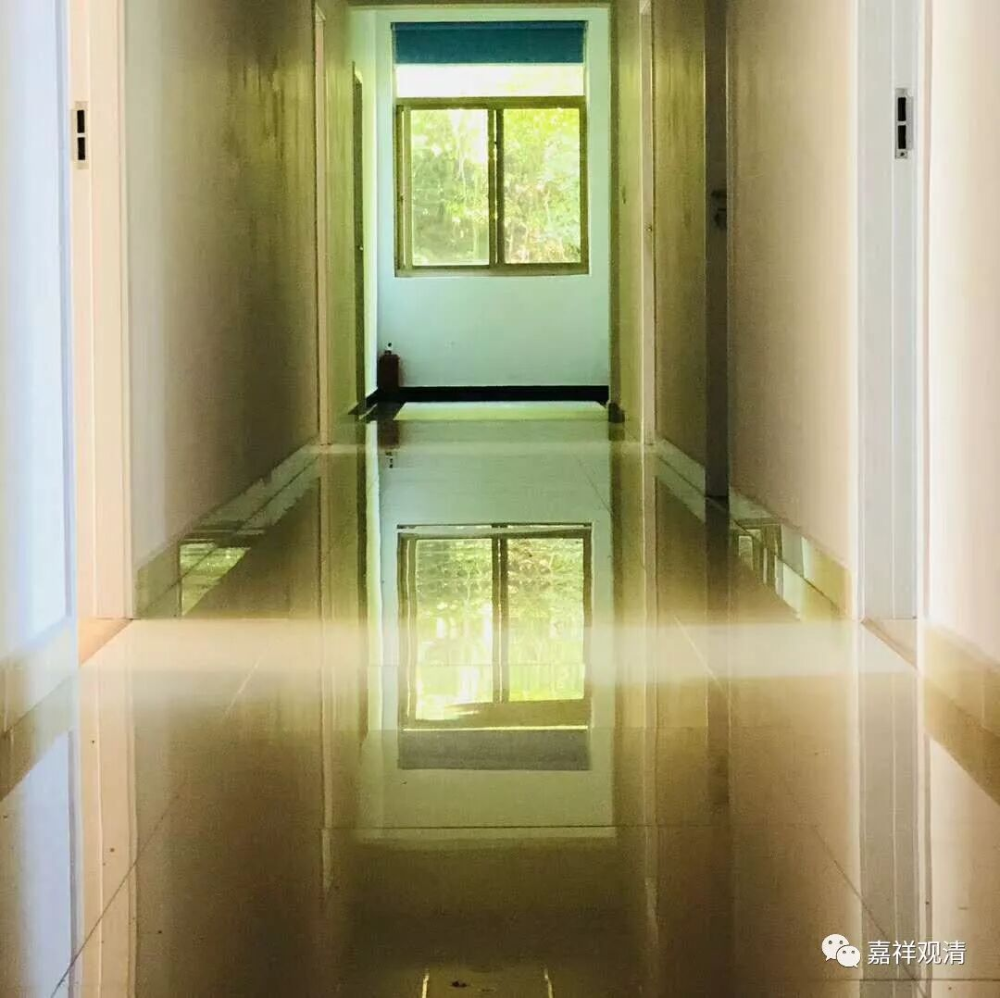
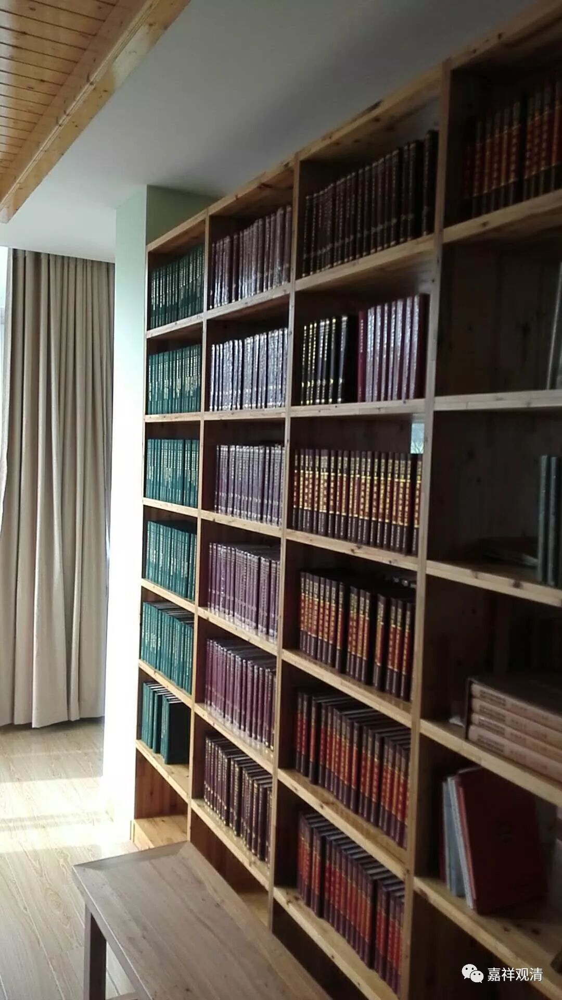

**《善說精髓》讲记001**

还有人没有到，我们就先聊一会吧。

福报呢，是不是本来就有一个定数的？比如说满分是500分，那么你得到的是300多分，然后你自己去各方面平衡一下，是武力多点呢还是智慧多点，或者再多出点什么币啊等等。显然我们在上辈子设置福报的时候，和2500年前的那些罗汉们的设置有点不一样，他们的设置好像是生活条件比较差一点，但是能够有遇到佛的福报，而我们的设置则是修行的外部环境比较好。他们当时都是坐在树林里面，每天被蚊子咬的，我们现在都是这么好的环境条件，但是总分还是差不多的，所以现在我们修行的结果也是有点糟糕，是吧？我怀疑是这样，你们研究下看看……

如果你们不相信的话，就先试试看，今天晚上就睡到在树林里面去，被蚊子咬，试试看，说不定今天晚上就成就了呢？说不定这样晚上就梦到了佛了呢？现在我们的条件真的是越来越好了，这里的环境也是这么好，不过不是我搞的，是居士们大家一起共生的。哦，说共生也不对，应该是缘生，这个是缘生。佛教里面讲自生、他生、共生、无因生，这四个都不对，是吧？所以我说共生也不太好，应该是属于缘生，由因缘生起了这样一个比较好的修学环境。

当然也一定有不好的地方，因为轮回当中100分的东西是没有的。与其在其他地方出现问题，还不如仅仅是最初和包工头有点不舒服比较好一点，那后面的事情会清楚一点，会干净一点——钱方面的事情还是容易解决的。如果去挑选的话，还是在修行方面没有压力比较好。

我们现在这里条件很好啊，包括你身下的座垫，只要你们愿意，每个人的屁股下面都可以坐5层——这好像是班禅大师的待遇啊！好像是一般的和尚只能坐一层，堪布是两层，比较大的寺院是三层，好像甘丹赤巴啊、班禅大师啊等等是四层到五层的样子。你们只要愿意，后面那些部都是座垫，大概还有100个，够你们再垫的。

现在这里的福报确实有点好，好像这里有一个人福报不是很好，睡地板的那位是谁啊？有一个人是睡地板的。哈哈，你的福报不是太好。不过我们可以建议大家福报比他好一点，今天晚上睡桌子，这个桌子好像跟床差不多了啊。

今天的天气也很好，稍微热一点，但是我们又有空调。想想2500年前的那个时候……假如有穿越的话，那个时候的罗汉穿越到现在，他们一定觉得：“哇！这是到了天堂！”我们现在的人如果一下子穿越到佛陀讲经的那个时代，一定会觉得到了地狱。多半是佛陀在上面讲经，我们到处在抓蚊子、抓跳蚤，佛陀就会说：“哎哎哎！你在干吗？”

我们现在的环境真的是太好了，包括能得到道次第的教授也是一样。以前道次第的这些内容都是秘传的，比如说《菩提道次第广论》，它基本上真的是一个实修的教授，而实修的教授原先是不形成文字的，是老师讲课的时候个别教导的。

好，我们开始吧。

