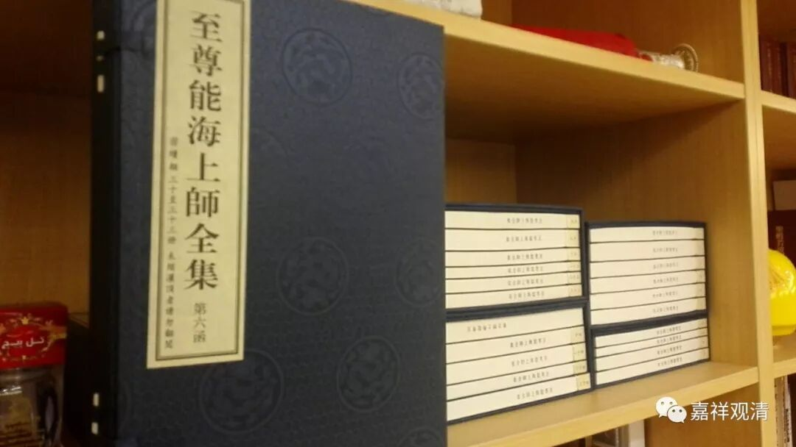

**《善说精髓》002（下）**

那么，菩提道次第自从法尊法师介绍到汉地以后，应该说是被大大地关注了。当时法尊法师在汉藏教理院里面是专门教授过菩提道次第的，后来在北京的中国佛学院也讲过菩提道次第。但是他的弟子们似乎并没有将此弘扬起来，这一点呢，是有点可惜的。什么原因呢？

我曾经碰到过老一辈的老先生，他们同时是法尊法师和能海上师的学生，都是很老一辈的人了，他们对我讲过相关的原因，我觉得也有点道理。他们的意思就是：法尊法师在长期的教学当中，其实他只有学生而没有弟子。学生对于老师教学的内容，好像并没有那种“我要很努力地把它传承下去”的责任感。而如果是弟子的话，这种传承的责任心就会比较强。

有一个很明显的对比，就是能海上师的弟子们在全国各地都开花了，是吧？全国有很多能海上师系统的道场和寺院，都是以传承能海上师的教法为己任。但是法尊法师呢，他最主要的真正能够称得上弟子的是两位大居士——胡继欧和杨德能两位先生。胡继欧的父亲是胡子笏，他在民国时期是山东省主席，是法尊法师入藏时的大施主。如果你们看《法尊法师论文集》的话，里面有说：“胡子笏先生讲得很有道理啊！学哪些东西更重要呢？学汉地需要的东西更重要……”

法尊法师入藏的时候，与他同行的大概有二、三十个人吧，最后成就最大的就他了吧，有些是根本就不愿意回汉地了，还有很多师兄弟、道友在路上就死掉了。他们到达打箭炉（今天的康定）这一带以后，有些人就身体不好圆寂了，包括法尊法师的师父大勇法师。

再后来，去到拉萨以后呢，有些人就根本不想回汉地了，他们说：“和拉萨比起来，汉地那就是边地。”意思就是，汉地可以被称为没有佛法的地方。确实，在当时拉萨三大寺的教学背景的对比之下，和汉地的差别实在是太大了（我认为，唐中期以后，汉地就数不出大师级的人物了；明中期以后，汉地佛教就已经到L型的底端了……）。

