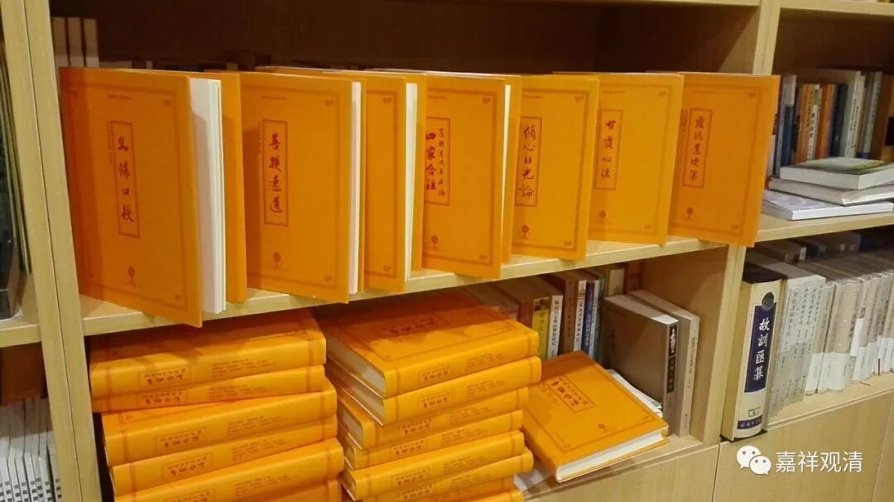

**《善说精髓》003（中）**

菩提道次第的论著翻译到汉地以后，我们真的是越来越幸运了。我们以前就光是听说有“八大引导”这样的名字，现在八大引导都翻译全了——《菩提道次第广论》、《菩提道次第略论》、《菩提道次第摄颂》、《安乐道》、《速疾道》、《道次第纯金》、《文殊口授》、《善说精髓》，短短这几年里面全都出来了，而且基本上都有了两个以上的版本。这些年，大译师仁钦曲札先生，还有缘宗师，都翻译了好几部的八大引导，现在就都全了。还有《掌中解脱》，连英译本都有两个了。真的是很感谢这些译师们啊！

另一方面，我们自己好像不太努力啊，那我们要更加努力啊，大家都要努力学习啊！我们最近还要学梵文，明年还有巴利文，他们还在学藏文——做人难啊！其实日语真的很好，有机会应该去学日语。我们到了日本之后，看到日本的佛教可能是走下坡路了，但日本的佛教学术还可以，里面的作品真的是不少……

上次我们七个和尚去日本走走，来了一次“真宗之旅”，专门腾出时间逛旧书店、旧书市场。我和另外一位法师就很不一样。我看到日文的作品，直接就当没看到，看到是汉文的呢，看了价钱以后再买。而那位法师很有趣，他自己不懂日文，却买了很多日文书回来。（哎呀，他比我要更慈悲啊！他是买书给别人看。）

我觉得我也不是一个很好的法师，太功利——我看到某部书比较好以后，我还要看看价钱。一看，四万日币！等于@#×&%￥……算了，算了，放那儿吧。再到隔壁一看，只有一本，而且是新书，再一看，一万日币！再想想，那部旧书至少是一百多年前的版本，然后又是一大摞，这才四万日币。算了算了，还是到隔壁把它买下来吧……可见我的态度还是不太对啊，大概是金牛座被催眠后的效果。

我们现在真的是很幸运啊，道次第的八大引导全部都翻译过来了，而且更多的书被翻译过来了（这里正好给我们嘉祥译丛再打个小广告哦）。大家有兴趣的话，可以一点一点接触。如果出家人的话，祈竹仁波切曾建议八大引导全部都获得口传会比较好，如果在家人的话，获得任何一个都可以。其中最短的是《菩提道次第摄颂》，这部《善说精髓》也不算长。那么，如果大家能够获得一个菩提道次第的口传，再好好地去学习，就比较好了。

