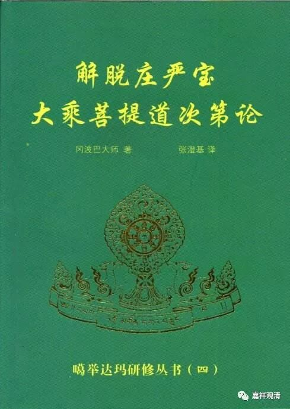
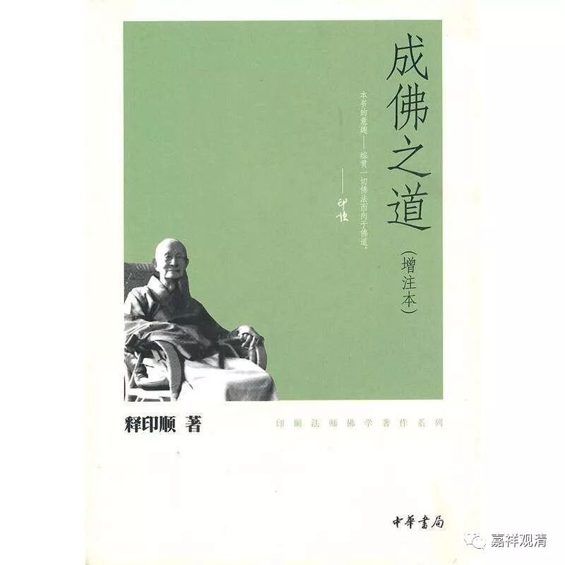
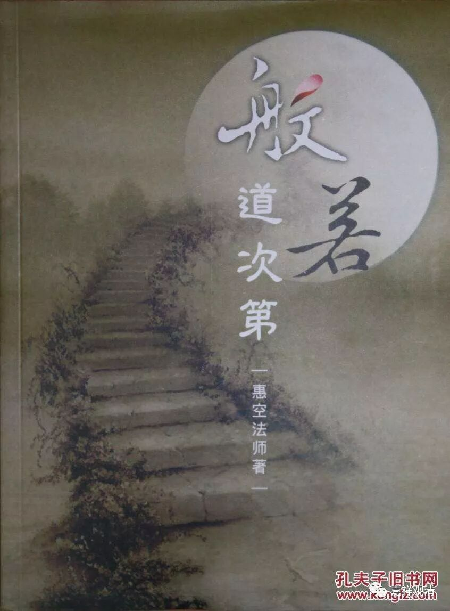

**《善说精髓》讲记004（上）**

在藏地，他们都会取一个比较吉祥的名字。如果单纯是吉祥的名字的话，也就那么一些了，在这里面取名字的话，也就没几个名字了。所以你们在藏地的寺院里面听来听去，名字就这么一些，什么“根登”啊、“阿旺”啊、“札巴”啊等等，这些名字你们肯定都听到过。这里的“札巴”，在安多地区叫“智华”，其实就是口音不一样，翻译过来就变成“智华”了，其实就是“札巴”。

好，那么作者就是达波·昂旺札巴，他是一位格鲁派的高僧。

其实道次第呢，不仅是格鲁派当中有，其他教派也有的。噶举派祖师冈波巴大师有一部《解脱庄严宝论》，也是道次第类的著作。其实道次第类的著作，最早发端于噶当派，而其余几个新译教派和噶当派都有师承关系，所以也都有道次第传承。旧译宁玛派现在也有道次第，现在大家都有、都讲，这都是受到阿底侠尊者的影响。阿底侠尊者真的是了不起啊！

那么，道次第一代一代地传下来，到了今天就越来越多，现在几乎所有的佛学院都要求有道次第的讲课。不过，很多都是没有传承的，只有道次第的讲解。

菩提道次第到汉地以后呢，汉人又对它进行了改造。（汉人真的很有这种祖师意识啊，还没吃透呢，就把道次第给改造了。）

有些著作和道次第的内容比较接近，比如印顺法师的《成佛之道》。实际上都是受到了道次第类著作的影响，总的来说还是蛮不错的，但是在书里面又不太承认传统道次第的一些说法，我记得好像是有不太接受“大乘行者必须要具备出离心”——这个算是对大乘修行的认识层面有不同吧。

另一些人就走得更远了……现在弯弯那边常有些半通不通的法师没事就编一本《某某道次第》，好像不这样不足以表示自己的能耐，实际最后只是现眼，骗骗下面听课打瞌睡的居士们玩玩……当然另一方面也说明“道次第”已经是一个大IP了，大家都想蹭热度。

不仅如此，“道次第”这个大IP的红火。甚至还影响了人们对其他经典的解读，比如就有人把《瑜伽师地论》的“地”理解为“次第”，白话版的《瑜伽师地论》的解释里面就有这样的文字，我写过文章批评过了……我是这么说的：

** 还是看《瑜伽师地论释》：**

** **

** “地”谓境界、所依、所行，或所摄义。**

** **

** 其中，依窥基大师之解《论释》：“境界”、“所行”各唯一解，“所依”、“所摄”各存二义。**

** **

** （境界：）是瑜伽师所行境界，故名为“地”；如龙马地。唯此中行，不出外故。**

** （所依：1、）或瑜伽师依此处所，增长白法，故名为“地”，如稼穑地。**

** （2、）或瑜伽师地所摄智，依此现行，依此增长，故名为“地”，如珍宝地。**

** （所行：）或瑜伽师行在此中，受用白法，故名为“地”，如牛王地。**

** （所摄：1、）或诸如来名瑜伽师，平等智等，行在一切无戏论界无住涅盘瑜伽中故，是彼所摄，故名为“地”。**

** （2、）或十七地，摄属一切瑜伽师故，如国王地。**

** **

** 若依《遁伦记》，则稍有不同：“其境及所摄各唯一解，依、行二种各有二解。”即：或诸如来名瑜伽师，平等智等，行在一切无戏论界无住涅盘瑜伽中故，是彼所摄，故名为“地”。这条，基大师判为“所摄”，伦法师判作“所行”。**

** **

** ……**

