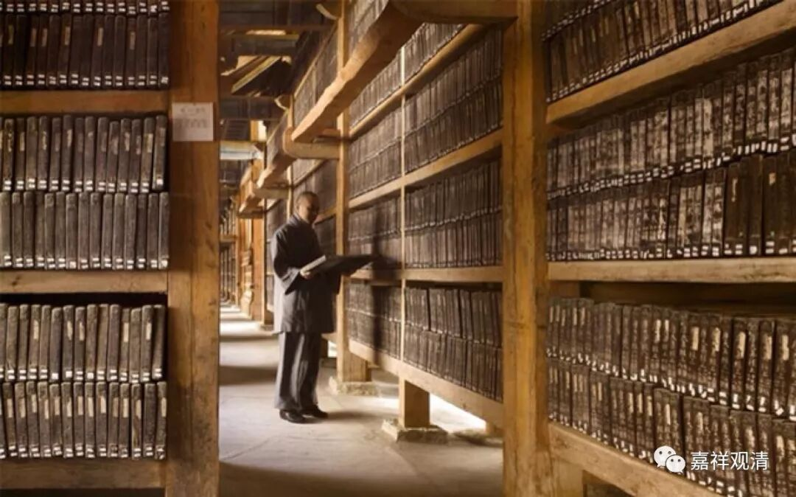

**《善说精髓》004（下）**

** “以胜三学教证业，能如实持佛密意，**

** 随学彼大阿阇黎，实修显密道次第。”**

** **

这个呢，应该是夸奖他的老师们的。这些老师们有增上的三学作为他们的庄严。增上的三学，就是戒、定、慧。外道也有戒定慧，而佛教的戒定慧就是增上的，是更加殊胜的。殊就是特别，胜就是超越。增上的三学，是更加特别、超越的三学，作为这些老师们的庄严。

“严”就是严饰，相当于首饰。戴着各种首饰来令自己更加庄重、更加漂亮。哎呀！我的词语很贫乏啊，想不出来了。世间人的庄严呢，比如说今天中国的明星们的庄严都是PS，还有抠图，对吧？用PS把自己抹得很白啊，搞得很靓啊等等。那么，这些师父们是以殊胜的、更加增上的三学作为他们的庄严。

还有什么“庄严”呢？他们的事业——教证的两种事业。《俱舍论》当中讲：“佛正法有二，谓教证为体。”佛教的核心内容主要有两个方面：一个是“教”方面的内容，比如说这部论著就属于教法；一个呢，是“证”方面的内容，就是我们自己能够做到的。“教”方面的呢，是佛陀所讲的，包括文字上所记录的和口耳相传的。“证”方面的内容呢，是我们心里真正得到的，真正被改变而趋向于法的这些东西。

佛法留存在世间，唯独依靠这两个：一个就是世俗上大家都能够接触到的“教法”，另一个就是在各位大德，甚至包括我们自己心中所留下来的“证正法”。这个“证正法”，并不一定是要证得了果位以上才算所谓的“证正法”，包括我们的皈依、五戒的持守，也是“证正法”。

所以，我们的这些师父们的庄严就是殊胜的三学，以及教证的事业。

“密意”，就是佛的究竟意趣，就是他真正想说的，解脱的核心内容、实际指向。

