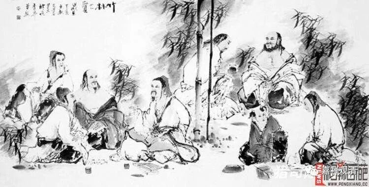

**《善说精髓》讲记005（上）**

** “能如实持佛密意”**，

能够如实——是什么样子就是什么样子。佛的密意，就是他的核心内容，是文字背后的内容，不一定是文字表面的意思。文字表面的意思很容易理解错了，是吧？这方面中国人很有体会的，中国的哲学界就“言不尽意”这个话题已经讨论了几千年了。哦，说几千年有点过了，讨论了一两千年了，就是语言和它的意思有没有直接的关联性。基本上得出的结论是：语言和意思，是可以产生歧义的。所以说“言不尽意”，就是文字并不能够完全表达背后的意思。（魏晋时代，“言尽意”和“言不尽意”一直是清谈的几大话题之一。）

“文字不完全表达背后的意思”这句话，佛教和汉地的玄学都能够理解，但是之后的发展方向就不一样了。既然文字不能够完全表示背后的意思，佛教就要求我们必须要“通达密意”，要了解背后在讲什么，要知道他的“意指”。而汉地的一般情况呢，就像某某法师的套路——“既然狗不听话，那我狗也不要了”，既然是言不尽意，那么“言”我也不要了。所以到最后就变成了禅宗，要脱离文字了。既然文字不能够完全表达意思，他就索性不用文字来表达了。他觉得：“这个文字我就不要了，我要‘教外别传’。”

这个呢，就完全是两种思路。我们中国人可能会有后面这种思路，所以一直到现在，像这种因明学得这么好的某某法师，居然也还会有这种思路，这个就是习惯的思路哦。我们平时也有这种情况：这件事情没做好，本来应该是再想什么办法去把它做好，结果反而变成“做不好，我不干了”，中国人说这叫“泼水倒掉孩子”。

我以前讲过一个例子，我的一个朋友劝他老婆要把门关关好，因为在深圳有跟在主人背后入室盗窃的事件发生。他的原意是想和他老婆说，让她小心一点，结果他老婆不听，半个小时以后，两个人就要闹离婚了。他的原意是什么呢？原意是想让对方注意一点，为了对方好，可是到最后呢，就变成“既然你不听，烦死了，那我们就一拍两散，不干了”。

汉传佛教的情况就是：他们理解了“言不尽意”——文字并不能够完全表达背后的意思，最后呢，就走到了“我不要文字”的地步。这就和佛教的原意，特别是道次第的理论，完全不一样了。佛教真正的本意，是让我们想办法从文字表面的意思去通达文字背后的意思——善于通达佛陀密意，这一点非常重要。

        修改于