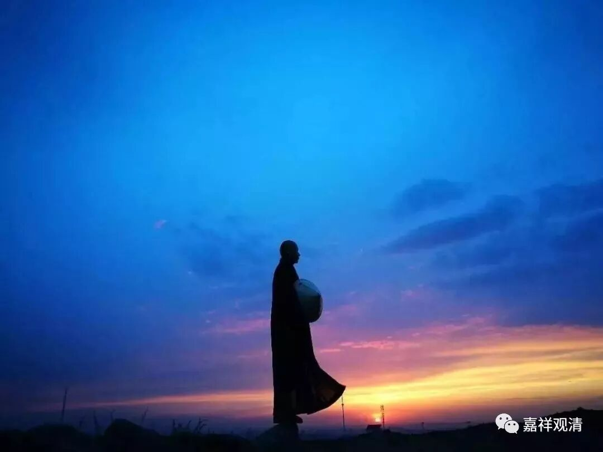

**《善说精髓》006（下）**

那么我们学佛也是一样，如果我们现在不好好学的话，你想说“我直接去净土”，那是你说去就去的吗？那你去净土的时候也不带智慧去（因为你没学过嘛）的话，即使你去了，也是一个“无脑儿”（没有因的果不存在！）。

我们总想着捡便宜，但事实上捡便宜这种事情不太可能，千万别多想了！就像这两天报道的新闻也是一样，结婚的时候都觉得对方“应该这样对我”，是伐？那，没有这种道理啊！是你自己想多了。或者，你自己又做了多少呢？因果不虚！

** “随学彼大阿阇梨”**，“阿阇梨”，就是师父们，就是我们今天讲的“和尚”这个词的最早的原型。这些师父们，我们要跟着他们去修学。

** “实修显密道次第”**，

我们跟着他们去实修。我记得《掌中解脱》好像也这么说——希望我们今天学习了以后，能把所学的都用来实修。

实修并不仅仅是坐在座上，闭起眼睛，就是实修了。我有一位老师对我的影响非常非常大，这位老师说：“有些人很有趣，自已不学习，看到我们学习就说‘有些人光知道学习，不知道实修’。他们的脑子里面，好像只有坐下去，只有闭关才是实修——不是这样的！你把佛教所讲的功德和内容在你的内心生起，这就是实修啊！”

我的这位老师小时候基本上就是一个调皮捣蛋鬼，他不杀人已经很好了，他妈妈只要听到村子里面有孩子哭，就害怕：“我的孩子又闯祸了”。他小时候的心理真的就是：“你要弄我的话，我真的就把你杀掉”。后来他出家，学习，慢慢在僧团里长大了，学习了五大部，还考上了头等格西——这不就是学习经教并实修了吗？虽然没有放光动地，但这种心理和行为的改变（从顽劣到博学、从狠厉到善规），谁还说这不是实修的结果？！

