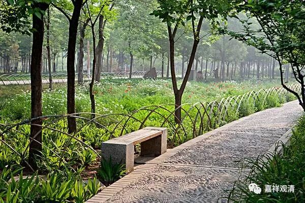

**《善说精髓》讲记007（上）**

这样一个闯祸大王，等到他考上头等格西以后是怎么样的呢？

我们那个时候在烟花三月的扬州，清晨一起从宾馆里出来在院子里散步，路上就会有很多泥里的蚯蚓爬出来，他就拿着树叶，差不多是一个一个地把这些蚯蚓搬到路边上去，把它们运送到路边上的泥地里面去。蚯蚓很多，他就在那里一个一个的用树叶拖起来（我忘了我有没有帮着干。一般我这么伶俐的一定会帮忙干的，不过现在脑子里的画面里没找到我的影子）……

我们想想，他的这种“实修功德”不就是这一二十年学来的吗？如果在以前的话，他根本就不会做这种事情啊。以前你要是惹到他的话可不得了，他有一个表哥曾经把他揍了一顿，因为他打不过他表哥，他就差一点点把他表哥给杀了。从睚眦必报不计后果，到博学明辨殷切护生，这不就是实修、实证的功德吗？这也是功德啊。并不是你闭起眼睛，眨巴眨巴，就是修行了，不是啊。我们现在戒定慧的功德都算是功德、都是实修啊。

有些人自己学得少，反而说别人：“哎呀！他们学得太多了。”这两天我碰到位个法师，刚从XXX地方回来，和我聊天的时候就是这样。他觉得呢，学得多了就不是实修，好像他们学得少的才是实修。可是，他忘了一件事情，这是道次第里面一直在讲的一件事情，雪歌仁波切也讲过这个事情，其他的格西们也讲过这个事情——修行是什么？

修行可以这样来比喻：如果是声闻乘的话，你用一个方法能够进这个城，或者说从一条路能够走进来，那就可以了。如果是大乘的话，那你可以用无边的方法来解决这个问题，包括对空的理解。你并不是只有一条路，你可以有很多条路去理解空性，你可以用很多的方面去思维、去观察、去证明道次第，这个才是智慧广大的表现。

如果你只用一个方法进城了，然后你想去教其他的人，那么，绝大部分的人你是教不了的，他们是不听、也听不了的。你自己觉得只有我这个方法最好，其实最多就是这个方法正好适合你而已，最多就是这样。

