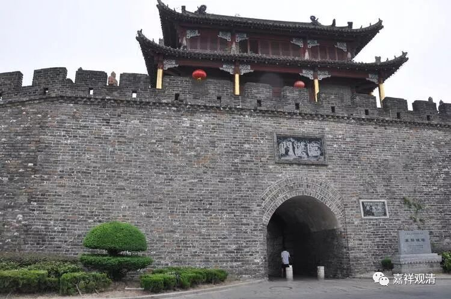

**《善说精髓》007（中）**

我的老师说过，辩论的时候就是这样的，就像守城一样，一个人在守城，其他几个人在攻城。而攻城的人是从什么地方进来的呢？不知道的。这么大一个城池，他从什么地方进攻是不知道的，你必须在他攻进来的任何地方都挡住，你才能够把整个城池守住。所以你必须要有广大的智慧。我们学习道次第也好，学习佛法也好，甚至学习日常生活中的其他东西也是一样，都必须要有广大的智慧。

就是我们读书时候的学习也是这样。我记得曾经有一次被老师夸奖，是有点激动的，为什么呢？当时大家一起在做数学题，答案已经做出来了。但我在做完以后，又把答案涂了，重新做了一遍，因为我发现有一个更加简便的方法，于是我用那个简便方法又做了一遍。然后我的老师就夸奖我：“很好，在知道有一个解题方法之后，再重新用简便方法做一遍，很好，很好。”

所以说，同样一道题目，如果能用多种方法来解答，那真的是很好啊！（不过现在听说孩子们做题要做到半夜2点，实在是……我弟弟的一个朋友的儿子，居然晚上做作业都要做到半夜1、2点，很惨啊。）

** “实修显密道次第”**，

我们要把道次第中所学的内容用来实修，运用在自己的生活当中。很多人会觉得运用在生活当中这个事情非常神秘，其实不神秘啊，把你所学的东西用进去就可以了。最简单的就是思维方法，我们现在学的就是思维嘛，你就把这个思维的方式用进去嘛。我们学习中医也是一样的，就要把中医的思维方式运用到生活当中。我记得《医宗金鉴》中间有句话：“治病必求其本。”我们做任何事情都一样，你要找到它的因，找到它最初的那个动力，最初的那个背景，然后去解决它。

所以这个道次第，我们是要用来实修的。那么，为什么这里要说显密道次第呢？一般来讲，菩提道次第是属于显宗或者显教的部分，此外，还有密教的部分。在藏传佛教当中呢，密宗是比较流行的一个部分，所以这里讲完显宗的部分之后，又讲了关于密宗的部分。虽然关于密宗的部分讲得比较少，也还是要提到一下。因为佛教当中既有关于显的内容，又有关于密的内容。密的部分呢，我就不太懂，所以我就不讲了，密的这个部分压力太大了。其实今天的绝大部分人有机会学密宗吗？能够碰到结个缘已经很不错了。

就是说，这些显密道次第的内容都是要用来实修的。实修就是实践嘛，刚才我讲的《中阿含经》的那一段《七车经》，属于“习相应品”，第一个字就是习，就是修嘛，修的就是道次第的内容。

