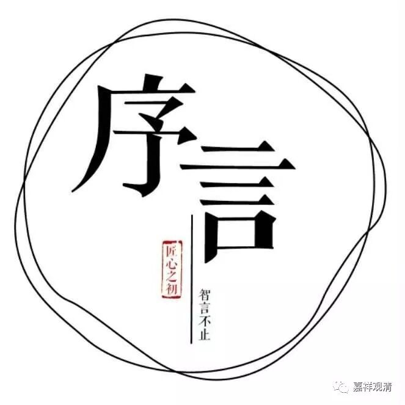
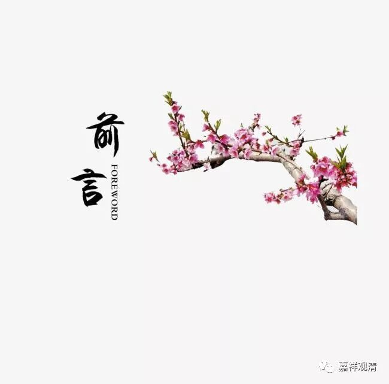

**《善说精髓》007（下）**

** “此中菩提道次第引导分四：”**

** **

菩提道次第的整个大科判——大的方向，分四个。其中篇幅展开后最大的科判是最后一个，实际上可以说是本论的主要内容，就是我们该怎么修行，或者说师父该怎么教弟子，差不多都在第四个大项里。

** “（甲一）作者殊胜。”**

** **

这就相当于我们在写书的时候，先把作者夸奖一下。比如说某某师写书的话，就先请A大师把她夸一遍，或者先请B大师把她夸一遍，这就是作者的殊胜嘛。这个作者——某某师，以前曾经在哪个学校，做过哪些好事，得过哪些奖……把这些全部都写上。作者如何殊胜，不是就这样吗？最好是再找几个行业内的大牛人来写序。如果是藏传佛教的话，可能会再写两首诗来赞叹一下。所以第一个“作者殊胜”，类似我们今天的序里面介绍作者的部分。

我们了解了“作者殊胜”以后呢，我们比较容易学得进去。就好比你们去看医生，一听，这个医生是个名医，或者治好了多少例癌症，立马就会非常相信他。比如有人来找我：“师父，能不能给介绍一位名医？”我就给你介绍一位名医，先把他夸一遍，然后说他治好了200个癌症病人，那你肯定会说：“好，马上带我去吧。”所以，这里也需要先讲作者殊胜，需要讲很多，就让大家对他产生信心，对他所讲的教法也产生信心，对吧？

** “（甲二）法殊胜。”**

** **

第二个就是讲内容好。这里讲“法殊胜”，还没有开始讲法，还是在做广告的阶段，说这个法怎么怎么好。比如说我们来介绍姜神医，“他用的药都是非常难得珍贵的。他自己家里做的九制黄精，外面的黄精最多是一蒸一制，能够三蒸三制就不错啦，而他是九蒸九制，完全没有农药残留，又按照古法熬制……”这个药还没出来，你就已经彻底信服了，病已经好一大半了。

然后再告诉你或应该怎么去看病，姜医生他喜欢些什么，你如果把姜医生的马屁拍好，那你肯定会如何如何。假如姜医生喜欢收藏的话，这个病人马上就去买个手把件，然后再去看姜医生的时候把它拿出来。姜医生一看，然后就开始“正理教授自利利他”，对吧？他会最用心来治你——我觉得是这样啊。

所以这里也是，先讲了作者殊胜——写道次第的作者阿底侠尊者如何如何地好。第二个呢，就讲法殊胜——道次第的内容如何如何地好。相当于今天出版物的序言里面，介绍了作者以后，介绍书的内容。

** “（甲三）如何闻说其法。”**

** **

我们应该怎么做，师父又应该怎么做，自己已经完全准备好了，身心都已经调整完了，最后才开始引导。相当于序言里面说“本书应该怎么阅读”。

所以前面三个科判都是广告。看起来我们佛教做广告也挺厉害啊！哎呀，我以前没觉得，以后我也要按照这个来讲，讲课的时候就先把自己的殊胜讲一下——也算是作者的一个“自序”嘛。

