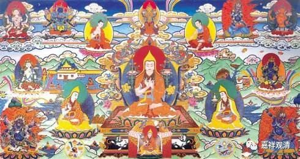

**《善说精髓》讲记008（上）**

** “（甲三）如何闻说其法。”**

就是我们应该怎么听，讲法的人应该怎么讲。放在一般的《序言》里面就是介绍著作的意图以及推荐读者如何阅读。

** “（甲四）如何正以教授引导弟子之次第。”**

** **

这个后面就是正文了。说明整个道次第都是教授的，是直接引发你的心生起相应的证量——相应的佛教的核心内容，比如说“依止善知识”啊、“暇满人生难得”啊这些，引发在你的心里面生起。

还有一点，某些人学得比较死板，或者是某些佛教系统的要求，认为你必须把前面的内容学到100分，才能开始学后面的内容。实际上并不是这样的，我们的学习一定是螺旋式上升的。我们学习《现观庄严论》、学习《集论》、学习道次第等等，第一遍、第二遍和第三遍学的时候，是完全不一样的。你学完一遍以后，再去学习其他内容，回过头来再看第二遍，就会看到和以前不一样的东西了。我们要这样螺旋螺旋地看过来才是。

你想第一次学就学到100分，绝不可能啊！除非你真的是再来人。看样子至少我不是，我没有一下子学到100分的。据说再来人的话，就是你跟他一讲，他立即就懂了，像六祖大师这样，是伐？禅宗里面的大师，你给他扬眉眨眼手一挥——开悟了。这是很有趣的一个事情哦，明明之前他是学过的，然后非得要碰到那位师父，再手一挥才能开悟。我们呢，就把前面学习的部分统统“剪掉”，光去学挥手了。师父只学挥手，弟子只学怎么看挥手，看得眼睛都直了，也没开悟。准备到下辈子继续等着开悟……那禅宗里的话——驴年去！驴年是没有的，想瞎撞着开悟也是不可能的！

** “（甲一）作者殊胜。”**

** **

** 详见他文。”**

** **

之前是科判，这里展开……可是，不展开了。其实类似我们有的书没序言，或者有序言，却并没有介绍作者的这一部分。其实很正常。但是“道次第”通常格式都要有这一部分，所以或者广说，或者略成一个归敬颂，又或者放在科判里面……总之，传统上不能少了这一科。

“道次第”的“作者殊胜”的“作者”和今天的“作者”的意思是不一样的，今天的意思是著作人，但道次第里的“作者殊胜”实际是介绍的“道次第”类著作最早的作者——阿底侠尊者，这有点类似于介绍学科创始人。由于“道次第”类似于学校教材，我们甚至可以比作，在初中物理学前言部分介绍伽利略、牛顿——这样大概比较容易理解，为什么明明本论作者是达波·阿旺扎巴，却在“作者”这里介绍阿底侠。

        修改于