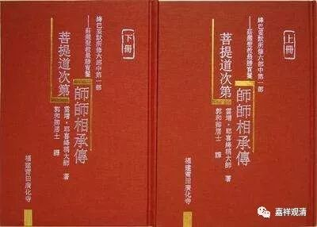
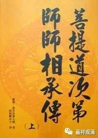

**《善说精髓》008（中）**

作者部分本文不展开了。那我们这里图书馆里有《阿底侠尊者传》，还有《菩提道次第师师相承传》，里面都有阿底侠尊者的传记，有机会可以看看。

这个就是“作者殊胜”，意思就是一代一代的祖师是多么的了不起，然后我们也是一代一代的祖师传承下来的。胡医生也是这样，出去就说：“我是孟河学派颜氏第五代传人。”感觉自己也快坐到那个传承表里面去了，是吧？会有这种感觉。前面先要把师父夸一遍，有时间的话，一代一代的师父都要夸，颜老——颜德馨怎么怎么样，后面的颜乾麟又怎么怎么样，最后是胡老怎么怎么样……

道次第科判里这段“作者殊胜”当中的要求也是一样。如果讲一个人的话，就讲阿底侠尊者，如果讲多人的话，可以讲整部《道次第师师相承传》，然后再接下来，一直到你师公、师父。

《道次第师师相承传》这部书好长啊，而且还很有趣。《道次第师师相承传》的前面部分，我们还能根据个人的经历，记得谁是谁，“最牛的是龙树，到处挑战是圣天，无著上升都帅天，世亲写《俱舍论》，安慧上一世是鸽子，和月官辩论的是月称……”到了离现在大概四百年左右的这些传承师，开始不一样了——几乎每个人的传记都差不多：小时候是放牛的，然后去到格鲁派的某个寺院，然后跟随某位老师，考上什么格西，然后再去某某地方任堪布，又去某某地方任堪布，再去某某地方传法，最后写了多少多少书，班禅、谁谁都是他的徒弟，最后在某某年圆寂……

再看下一位祖师，几乎是一样的，就把名字和地名改一改，内容没啥区别，后面都是一样的：小时候在另外一个地方，如果前面那位是放牛的，那么这位就是放羊的。或者稍微好一点的就是小时候跟随某位活佛，家里不同意，然后自己逃出来……类似于这样吧，就是最初在出家之前的事情稍微有一点点的不同，出家以后的传记近四百年看多了会发现都差不多的。

