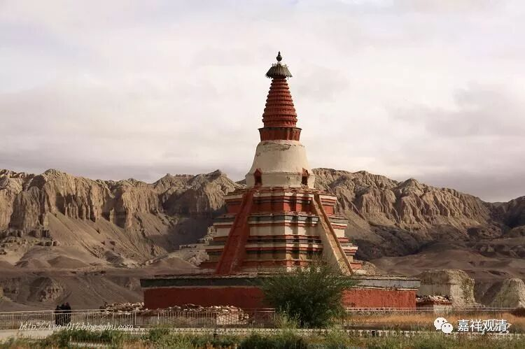
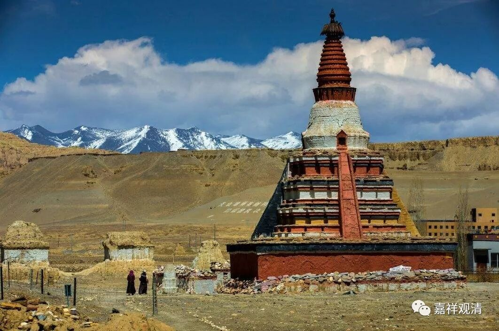

**《善说精髓》讲记010（上）**

哎，我们怎么讲到玄奘法师这里了？哦，今天要讲阿底侠尊者，结果一直讲到了玄奘法师。

那么，阿底侠尊者出家以后，他能够被大家尊重的一个原因是他的背后有支撑，而我们的玄奘法师也是背后有支撑——有强大的祖国。今天，我们的祖国也是十分强大，前两天好像又撤侨了，是吧？中美洲的飓风不是刮得一塌糊涂吗？东航就派了两架飞机去撤侨。现在中国真是非常强大啊！这两天是我们的国庆节，全世界都在过中国的国庆节呢。

阿底侠尊者在当时的印度次大陆是非常有名的，那个时期在今天的藏传佛教被称为“后弘期”，也就是佛教第二次大规模地从印度传入西藏的时期。在此（阿底侠入藏）之前，有大译师仁钦桑布稍微早一点的时候也去到过印度，现在的传记上还说去了一百多个人学习，最后因为气候原因，藏人不耐热，最后只有三个人活着，是吧？后期的故事就是这样丰富……实际却并不是这样的（大数据告诉我们，藏人离开高原明明活得更长嘛）。晚期的传记离真正的历史已经很远了……

我最近写过一篇文章谈到，今天我们所看到的西藏早期的一些传记（比如《仁钦桑布译师传》）就不是如晚近的故事这样记载的。当时（藏传佛教后弘期之初），阿里这边最主要就是大译师仁钦桑布过去印度学习的，同行的有其他人，但其实是服侍他的，不是主要去学习的，也没有百人之多。从印度回来以后，仁钦桑布又开展了很多的教学，然后带出了一些弟子——早期的历史记载是这样的，并没有“上百人死剩三个”的悲壮故事，说起来，以前听到这么悲壮的故事还蛮感动的。

托林寺，仁钦桑布后期主要驻锡的寺院

仁钦桑布在印度待了很久，而因为阿底侠尊者那个时候在印度的名气比较大，所以仁钦桑布就把这名气带回了中国，那么阿里地区也就知道了“阿底侠”这个名字，后来阿里王又派了拿错译师去迎请阿底侠尊者。仁钦桑布的年龄要大于阿底侠尊者——这一点符合阿底侠很年轻就出名了的传说。

