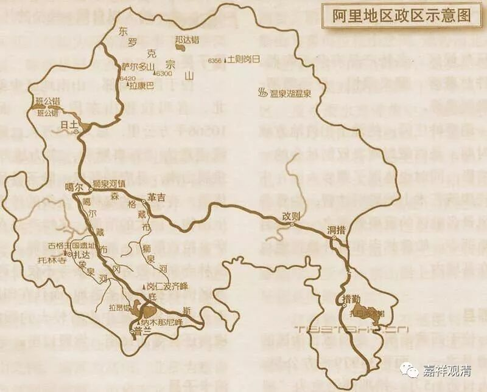
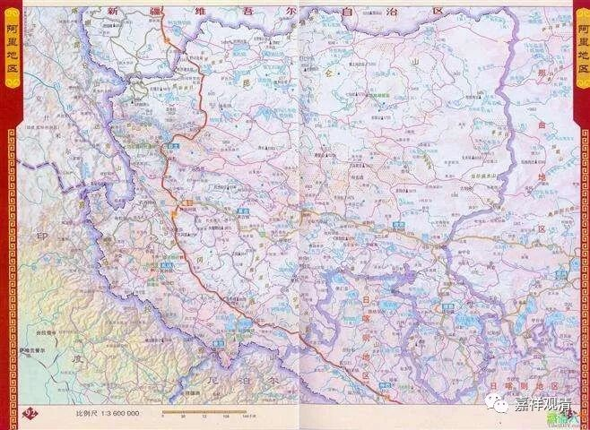
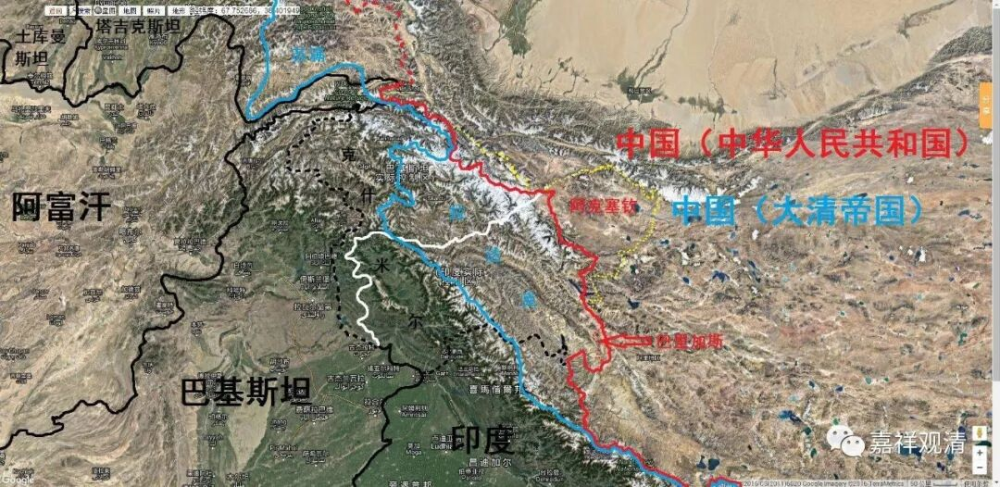
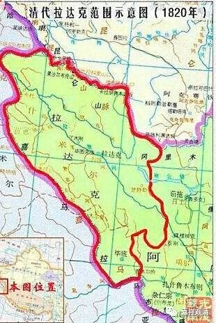

**《善说精髓》010（中）**

这里面呢，又有一个故事了。在传记当中说绛曲沃的爷爷益西沃，是被葛逻禄人抓到的，是吧？其实不是。最近我又看到，葛逻禄人这个名字，这个葛逻禄语好像是属于“阿尔泰语系”——前两天我们在学习梵文，讲到有四大语系。葛逻禄人实际上活动于今天中国新疆一带，新疆人去到西藏是比较晚的，他们打仗的时候曾经到过阿里，但那是比较晚期的事情了，就是说晚于阿底侠时期。所以是西藏人的记忆错乱了，类似的事情是有的，但实际上被抓的并不是益西沃，而是他的另外一个孙子沃德，这个人后来死掉了。益西沃是死在托林寺的。也没去过克什米尔。

据古格·阿旺札巴所著的《阿里王统记》（P58-59）记载：

** “……（拉喇嘛·益西沃）他年事非常高的时候，带着拐杖对自己的修行场所转很多圈，发放布施取悦于众生。此是，有令在先，出了一名徒弟外不见任何人，整整三年闭门修行。修行完毕，以平民百姓的身份接见朝觐者，并为了最后传法，来到莽巨，后又回到托林寺，为佛法和众生奉献精力，直至寿终正寝……”**（转引自《传奇阿里》P116）

可见益西沃在托林寺寿终正寝，而非死于葛罗律人的监狱。

另据《阿里王统记》（P61-63）记载：

** “……大哥维德（沃德）赞身强力壮，自小性情暴烈，凶猛无比。有一次征战到玛玉（拉达克），建立了拜土寺……后在竹夏（勃律）激战……在此受挫……两个弟弟试图赎回哥哥，敌人要与他身量相等的黄金，因黄金数量欠了一点，暂时留在那儿……他卸开脚镣逃跑，因无法逃脱因缘，铁锈中毒，就地去世……”**（转引自《传奇阿里》P116）

这是“益西沃被俘死去”的故事原型——孙子的事情被按在了爷爷的头上……

 （地图上的拉达克地区，就是当年沃德征战失败被俘的地方，在今阿里西北，今在克什米尔印度实际控制区。）

后来绛曲沃（沃德的堂弟，益西沃的另一个孙子），也就是菩提光，就迎请到了阿底侠尊者。阿底侠尊者其实是在寺院（大菩提寺，就是今天印度菩提场哪个寺院）请假去的藏地，结果呢，藏地就很幸运。但是对整个佛教来说，不一定是很幸运的事情，至少对印度佛教来说就不是很幸运的事情。因为当时伊斯兰教开始通过印度的西北走廊向印度进攻，阿底侠尊者在进入阿里地区以后，本来打算回印度的，但是这条走廊已经被伊斯兰教占领了，他就回不去了。所以他后来没有回印度，这和伊斯兰教跟佛教的战争有关，等于一系列的穆斯林对印度的入侵行动把阿底侠尊者留在了西藏。

对西藏来说这是一件好事，对印度呢，就不是了。不过，估计阿底侠尊者回去也是要被杀的，嗯，那还是留在西藏吧。如果你们看阿底侠尊者的传记，可以看到他的兄弟，还有他的侄子，后来都去了西藏，是吧？当时真的是有一大批印度人都去了西藏，因为确实没有其他地方可逃了，往北逃还是比较容易一点。而且呢，当时西藏又不太发达，不是伊斯兰教的目标。伊斯兰教侵略的主要目的是去掠夺的，对吧？

