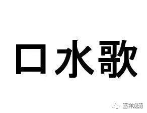
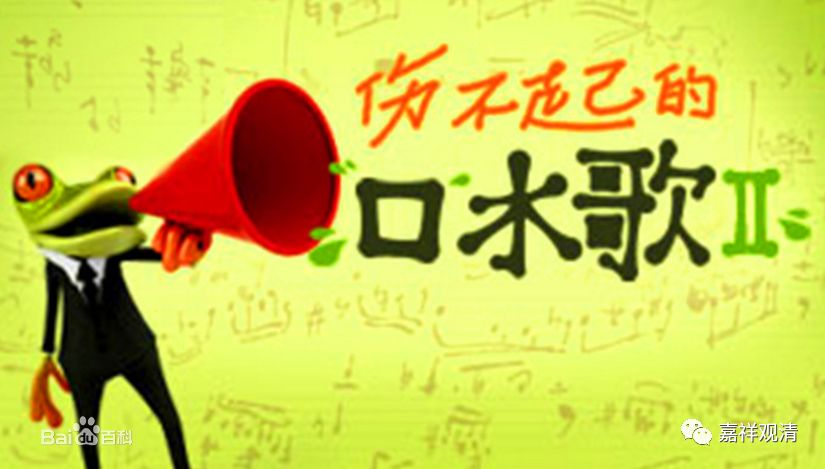

**《善说精髓》010（下）**

后来阿底侠尊者就被迎请到了西藏，他在藏地的上首弟子就是仲敦巴尊者，是一位居士。之后就留下了噶当派的口传的传承，格鲁派的核心背景就是由噶当派传下来的。但是，相对于今天的格鲁派而言呢，噶当派对密法没有这么关注。早期的噶当派对密法学得并不是很多，主要学习的也是个别的事部、行部的法。

当然也有另外一个原因，很多的密传在今天都已经是很“无密”地在传播了，以前都是一两个人之间进行传承教学的，现在呢，动不动就有成千上万的人在教学。这个也是佛教一直以来存在的一个问题：到底是走精英路线呢，还是走大众路线？

直到今天，我还觉得这是很矛盾的。到底应该走精英路线呢，还是应该走大众路线呢？我个人还是有点偏向走精英路线的，是因为这样比较轻松一点，自己也觉得自己比较牛叉一点。哎呀，有点自我陶醉啊。我觉得走精英路线的人，真的有点自我陶醉。我自己虽然水平不高，但是也有点自我陶醉。

如果明明是精英，却走了大众路线，那是非常值得赞叹的。我觉得阿底侠尊者就是这样一个典范。他绝对是一名精英，可以说是佛教精英当中的精英，但是他是走大众路线的。大家称他为“业果喇嘛”、“皈依喇嘛”，因为他是讲业果、讲皈依的。这太了不起了！精英走大众路线，就相当于顺子去唱口水歌。

前两天我在坐车的时候，听到司机在播放顺子的那首《回家》，我当时就想到了这个事情。顺子的声音真的很好，是吧？她的歌别人是没法唱的，因为太高冷了。所以大家崇拜完了，就结束了。但是像任贤齐这种“心太软，心太软……”所有人都能唱的口水歌，马上就流行出来了，是吧？阿底侠尊者就相当于帕瓦罗蒂那种水平，然后去唱“左三圈，右三圈”的歌曲，这就需要放下身段。也说明他完全没有那种傲慢心，没有那种“所恃”，没有自己骄慢的地方。

阿底侠尊者去到西藏以后，应菩提光的邀请回答了很多问题，包括佛经的前后问题、显宗和密宗有没有矛盾、清净的比丘能不能修这个那个等等，好像总共有十几个问题。阿底侠尊者听到这些问题之后是非常高兴的。话说回来，在这点上我们这些人真的是没法比啊，我们要是听到这些问题，马上就是：“烦死了，我已经讲过这么多遍了，你还不知道？！自己去听我的录音。”这也是师徒的缘分好，徒弟正好问到关键点，师父正好憋了很久的心得正好倒出来……

