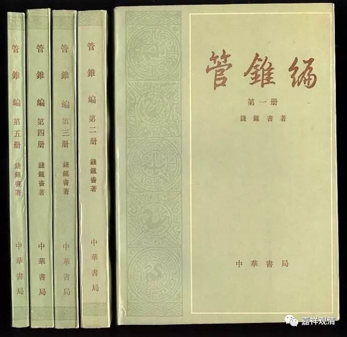
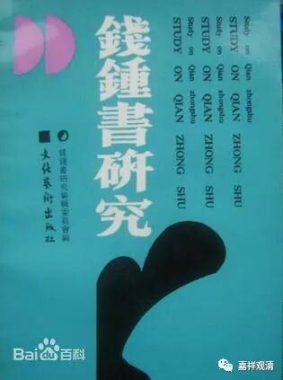
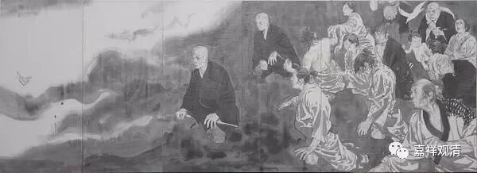
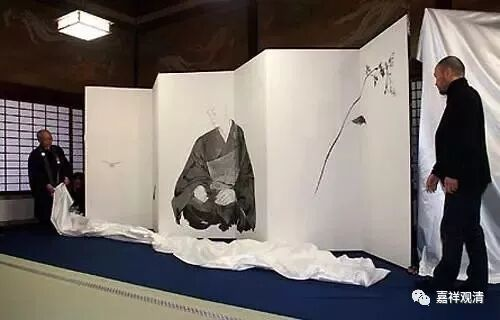

**《善说精髓》012（中）**

** “（甲一）作者殊胜。”**

** **

达波·贡钦昂旺札巴是本论的作者，他在这里是不想说自己的，但是我们还是要说一下这位达波·贡钦·昂旺札巴的，是吧？达波，实际上是地名，这个上次我已经讲过了。因为相同名字的人实在太多，所以我们要进行区分的话，光讲他的名字已经不行了，如果再讲地名的话大家还可以知道。

比如，你说达波大师，大家可能知道是在说谁。你要是说昂旺札巴的话，那就没办法知道是谁了。观清师百年以后，如果大家说“观清大师”，已经没人知道是谁了。有好几个叫观清的，是吧？香港几十年前还有一位观清呢。好像是哪个寺院里开山的，。不过历史上好像观清并不多？就两个。这个名字为什么这么少啊？我师父给我起这个名字的时候，我还想：“为什么师父不叫我观空呢？”没关系，以后叫“白云大师”吧，辨识度应该会高些。

那么，达波·贡钦·昂旺札巴大师，他曾经做过下密院的法台。放在今天来说，你做了下密院的法台，相当于什么呢？相当于你已经是候补甘丹山派整个的法台了。

总的来讲，对师父、对作者比较崇拜的话，对我们的学习会有好处，会比较容易学进去。就像我们看书，我们小时候慢慢慢慢地长大和学习的时候，是有一个经验的：我们看书的时候，肯定是首先觉得这本书很好看，然后再看这本书是谁写的，接着就会去找这个作者写的其它书，或者还会找来他的传记。比如喜欢《围城》，于是知道钱钟书，慢慢学着读《谈艺录》、《管锥编》，甚至还去收藏《钱钟书研究》……然后你会喜欢上相关学科、相关学问。

一般都是这个样子的，看漫画也是这样的对是吧？

上次我跟着其他法师去日本，他们说要带我去看漫画展——还好这个漫画展没开始。他们带我去看了一幅亲鸾上人的图画，说要去看这个画展，说这个是谁谁谁画的，他俩报了一个作者的名字，但是我脑子里一点印像都没有。他们说画的是亲鸾上人，对亲鸾上人我也不感兴趣，对那个画家我也不认识。

** 井上雄彦画作《亲鸾上人》
**

结果他们又说，“这个作者就是画《灌篮高手》的”，这下我就知道了。单单报的作者名字我是不知道的，但说是画《灌篮高手》的，我就知道了。哦，是井上雄彦啊。我们有照片吗？可以给大家看看啊。他后来是越来越严肃了，都画亲鸾上人了，本来是画湘北的不良少年。

我们以前看书也是这样的，看到某一位法师的作品比较好，就把他的书全都找过来看一看。现在就直接看全集或者文集，法尊法师的文集也出版了，我们去买了一套。哎呀，买一套太少了吧？我们再买点吧。

就是这样，单纯地讲达波·阿旺扎巴这个名字我们可能还反应不过来，但一说起“《道次第》八大引导之一《善说精髓》的作者”，这样我们就容易想起来了……

        修改于