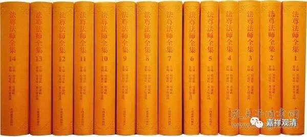

**《善说精髓》012（下）**

以前有一段时间一直很可惜，法尊法师翻译根敦主巴的《俱舍论释》一直没有出来，现在终于出来了——哪怕单是为了这个《俱舍论释》，《法尊法师全集》的两千块钱定价也不算多啊。接下去的任务就是龙相师负责把它打印出来。现在终于出来了，再晚一点拿出来的话真的没用了，总是会有人翻译的。这个《俱舍论释》是根敦主巴的解释。《俱舍论释》，我们又多了一门参考书。

有些人很奇怪啊，有好东西喜欢藏着掖着，不拿出来，这又不是玩收藏，这个不是吝法吗？！下辈子更听不到法吗？这个又不是密宗的东西，那么吝啬地放在那里干嘛？！从听说它的下落到现在都有十五年了，现在终于看到了，只花两千，太便宜了！图书馆也搞一套吧。

我们现在是幸福的烦恼——书太多，来不及看。以前真的不容易见到很多高质量的好书，但是现在……我们尽量快的多收集一点书吧，专业的书以后可能不容易见到了，淘宝也不像以前方便了……你们懂的。有时候一个时代，搜的一下就过去了，过去了你才会怀念它，才会觉得它的好……

达波大师最重要、最出名的就是这部道次第《善说精髓》了，其他的历史传记不是很清楚，其他民族很少有汉民族这么偏爱记录历史的，这也是一个汉民族的文化特色吧，就像印度的传统文化喜欢哲思、喜欢宗教。

今天上午先讲到这里吧，大家休息一下。那本书还是法尊法师手写的影印版呢，所以需要大家去把它打印出来。可以找20个人嘛，每个人分一段。

