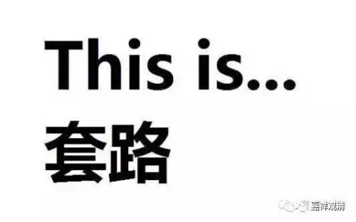

**《善说精髓》讲记013（上）**

好，我们继续菩提道次第《善说精髓》。对了，这个“精髓”不就是密意的意思嘛？就是能够把背后的意思讲出来的，就是“精髓”嘛。

我们上午尽讲八卦了，是讲到阿底侠尊者的造者殊胜。可以说作者的传承的整个背景，都算是造者殊胜。一般道次第的著作里面讲的作者，都不是指自己，都是指类似阿底侠尊者和宗喀巴大师这样的大师。藏人在讲造者殊胜的时候，就比如堪苏仁波切，有时会哭，甚至还哭得比较惨。这个就是“念恩”吧，只有真正的念恩才是这样。我们已经好久没有这样了，可能四、五十年前想到毛主席的时候会这样。看来就是我们现在的催眠还没有这么深，如果什么时候我们的催眠再深一点的话，大概也能一讲到阿底侠尊者就会掉眼泪了。

** “（甲二）法殊胜。”**

** **

就是整个道次第的好处在哪里，或者说好的地方在哪里。首先是介绍最主要的道次第的传播者阿底侠尊者，然后是说道次第的核心和重点在什么地方。

我们一般在书的前面加上序的时候也会这样——说这本书什么地方好，是吧？不过，中国人也有一些婉转的做法，他写序言的时候会把一些负面的内容也暗含着写进去。据顾老讲，范古老（范古农老先生）就擅长给别人写序言，别人写佛教的论著经常会请他写序言。那个时候他好像是管理印书事务的，佛教界也比较有名，所以很多人会请他写序言。

这些书出版以后呢，有时候会有人来问范古老：“哎，这本书其实某某地方有点问题，你为什么这么推荐呢？”范古老就回答说：“你看，我不是已经把那些有问题的地方说出来了吗？就是序言的这里、这里和这里……”就是他会把一些批评写在不起眼的地方，用不很明显的文字藏在那里。你如果对这些文字把握不当的话，就不知道他在讲什么。中国的文人当中，水平高一点的好像都有这样的本事哦。

不过一般的序言都是比较正面的，在介绍本书的时候都是比较正面的。这也是一个习惯。像我这样的人就比较少——在学习的同时就开始破自宗，一般的人和教材都是破他宗的。我大概属于“脑后有反骨”的。

