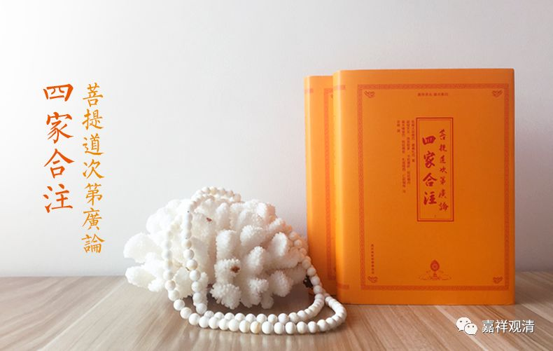

**《善说精髓》013（中）**

那么，法的殊胜当中分四个。这一点几乎每部道次第的论著都是这么写的，科判都一样。

** “（甲二）法殊胜。**

** **

** 分四：（乙一）通达一切圣教无违殊胜者；（乙二）一切圣言现为教授殊胜；（乙三）易获胜者密意殊胜；（乙四）极大恶行自趣消灭殊胜。”**

“** 极大恶行自趣消灭**”，这里是用“消灭”这个词，我们嘉祥版的《广论四家合注》当中，已经恢复为“损灭”了，最初的《菩提道次第广论》的版本是“损灭”，“消灭”是后来的版本，应该是讹误了。其实“损灭”、“消灭”的意思也差不多，但是好像“损灭”的意思稍微好一点。

** “（乙一）通达一切圣教无违殊胜者：”**

** **

意思就是，整个佛教的内容是互不相违的。

不相违在什么地方呢？最简单地讲，佛教有些地方在讲“空”，有些地方又会讲“有”，很多人就会觉得：“哎，佛教很明显地是前后矛盾的啊！这不是自己打自己耳光吗？”他们会觉得佛教所讲的是相违的。

那么，通常对这个的解释呢，我们会说是“不相违”的，为什么呢？佛教在讲“有”的时候，是讲缘起有，在讲“空”的时候，是讲胜义空，或者是自性空。

其实不仅仅是单单“空有”这一点，在佛说的很多地方都会有文字前后不一致的地方。比如说，有些方面在声闻乘的戒律当中是禁戒，而在大乘的戒律当中它反而是要去做的。还有些呢，在声闻乘和大乘的戒律当中都是要求禁止的，是不能做的事情，但在更高的一些戒律当中，又是要求应该要去做的。

这些经典里出现的似乎互相有矛盾的地方，我们从表面上来看是文句“相违”的，但是如果把它们放到整个道次第当中来看，或者是看它们背后的密意，你如果有足够的智慧，就会发现其实这样表面的“相违”是有原因的，背后是有“密意”的，有其文字背后的意思，有文字背后的逻辑。

