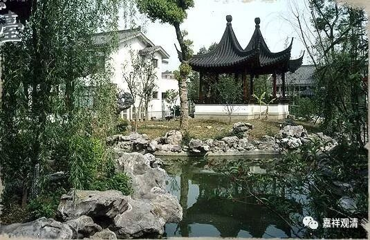

**《善说精髓》013（下）**

比如说，在声闻乘的教理当中，要求“少事少欲少希望住”——袈裟只可以三件，不能够更多，做事情至少不能像我们现在这样铺张浪费，恨不得住到竹林里面去，跟蛇住在一起。

（历史上佛教的传记当中，确实有被蛇咬死的罗汉。我们今天很多人都认为是罗汉就应该有神通，其实不是这样的，绝大部分罗汉是没有神通的。）

今天我们好像“少事少欲少希望住”的情况就比较少，当然对我们来说，都是贪的原因，但是对大乘来说，不完全如此。如果是因为要利益众生的缘故，那么别人布施他更多的袈裟，他是都可以收下来的。为什么呢？是为了给对方一个培福报的机会。至于他自己呢，可能还是三件法衣，但是如果有人来供养，还是可以拿的。

反过来就不行了。你的三衣是不能再送出去的，你一共才得一套，在大乘当中别人布施更多的，你还是可以接受的。但是你不能更少了，更少的话你连出家的戒律都快没有了，这个就不行了。

** “一切圣教无违殊胜”**，

意思就是即便在表面上发现有一些问题，如果你知道它背后的意思的话，你会发现这只是在不同阶段讲的缘故，就像我们在不同的阶段用药，是吧？在你有热病的时候，就不能用热药，而应该投以寒药，对吧？但是在你有寒病的时候，那就正好应该用热药。表面上看起来好像是相违的，但实际上是你的疾病不一样，或者是在不同的时间段也不一样。

比如感染的时候，人参就基本上不太用了，是吧？我们也不敢试。不过现在，觉得自己老了，收了徒弟，已经要被啃老了，那我人参应该还真是可以吃一吃的，要不然怎么被人家啃呢，是吧？

不同的时候，用药和其他治疗方式都是不一样的。那么，同样地，佛陀针对不同的人修行程度的不同，或者相同的人在不同的时间段的修行情况，给予不同的教授。这些教授在表面的文字上看起来好像是相违的，但是如果能够通达它们的密意——就是文字背后的意思，你就知道它们都是引导趋向解脱的，在什么地方，要求应该怎么做。

我们早上也讲了，在最初的时候，是要求把戒、定、慧这三个都抓起来的，是吧？到了彼岸以后，“法尚应舍，何况非法”，是吧？你如果再把船背在身上继续走，那是不可能的。所以不同的时间段，就会有一些不同的教授教诫。在此背后呢，就是“** 通达一切圣教无违殊胜**”。

我觉得可能还有一个情况，就是你对佛陀包括对你的师父非常地信任，你的信已经到达了一定的程度，那么无论他做什么看起来是相互矛盾的事情，你都会去想办法找这里面的原因。你会去寻找，或者去问老师，最后都可以找到答案。如果你对他的信心不够的话，你的第一反应就是：“他肯定是有问题的。”或者：“佛陀的脑子出问题了。怎么前后都讲得不一样了？”汉地的很多知识分子，比如随园主人袁枚，看佛教的《金刚经》就看不懂，觉得佛陀就是把一件事情颠来倒去地讲，前面正着来讲，还没讲多少呢，马上又反过去讲，他就理解不了。

