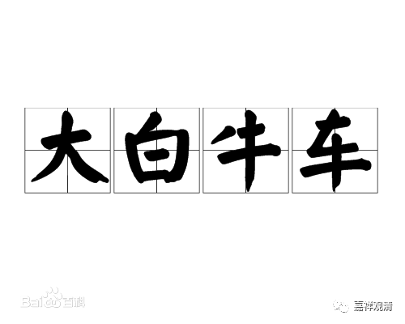
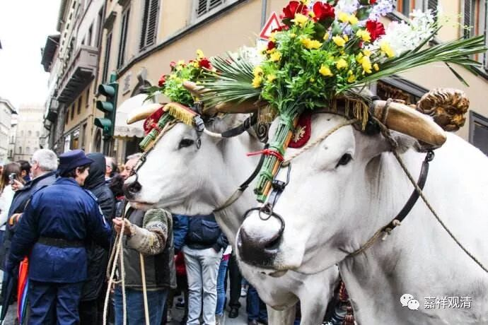

**《善说精髓》014（中）**

那么，汉地又会出现一个四乘的说法，是什么呢？声闻乘、缘觉乘、菩萨乘和佛乘这四个。菩萨乘和佛乘其实是没什么区别的，是一样的。在因位上是菩萨，在果位上就是佛。

在这个问题上就出现了中观派、唯识派和汉地其他宗派的区别。中观派和唯识派就说只有三乘——声闻乘、缘觉乘和大乘或者佛乘，而其他宗派的说法就不一样。大家看我们左边的这座山，它是四明山的余脉，是吧？在四明山的系统当中有一个很重要的派别天台宗，天台宗就认为应该分四乘，所以他们被称为“四车法师”。而唯识派和中观派都被称为“三车法师”。

在《法华经》当中，有羊车、鹿车、牛车，还有大白牛车。天台宗和华严宗这些中国传统的佛教派别，都认为这个应该是四车——羊车、鹿车、牛车和大白牛车，也就是“四乘”。而中观派和唯识派则认为“牛车”和“大白牛车”是没有区别的，都是“牛车”，后者只是稍微好看一点，认为菩萨乘和佛乘并非是各别独立的。

所以在有些地方把窥基大师称为“三车法师”，这个名称是正确的（因为他是唯识师，唯识师和三论师都是不承认“四车”的），但是他们又把这个“三车法师”解释得非常世俗，那是假的，是杜撰（肚子里面转出来的），是后期的伪造，甚至可以说是诽谤。我本人并不是唯识宗的，但是我要讲清楚，说窥基法师出家要求一车酒、一车肉、一车女人（还有个版本是一车书）常随，这个是对窥基大师的一种诽谤，历史上并没有这个事情。这是无知者的附会！

“三乘所有断证类，”断，就是指断除障碍，断除烦恼。“证”呢，相当于我们平时说的考得的证书吗？“证”的意思差不多就是，你证得的或者获得的这些内容（如果形成文字就变成证书了），否则就是你自己心里得到的这些知识的修行结果。这是指三乘的所有的断证的种类——注意，没有四乘。

